# Цвет и UX глубже: шесть версий одной страницы

Жёлтый снят. Каркас тот же (1+2+10). Меняется кожа.

**Правда — живой прототип**, не картинка из генератора.  
Запуск: `cd prototype && python3 -m http.server 4173` → http://127.0.0.1:4173/  
Цвет: вкладка **Ещё**.

Как читать страницу: [`docs/13-page-ux-2026.md`](../../13-page-ux-2026.md)  
Что улучшили: [`docs/14-ux-improvements.md`](../../14-ux-improvements.md)

**Галерея на GitHub:**  
https://github.com/7151104/self-discovery-ai/blob/cursor/ui-mockups-ten-interfaces-e6f8/docs/ui-mockups/color-v2/GALLERY.md

## Выбери палитру (страница после ступени 1)

«Сейчас» = ещё 4 вопроса. 590 ₽ тихое.

| Палитра | Кадр |
|---------|------|
| Сланец — холодный серый, вишня | 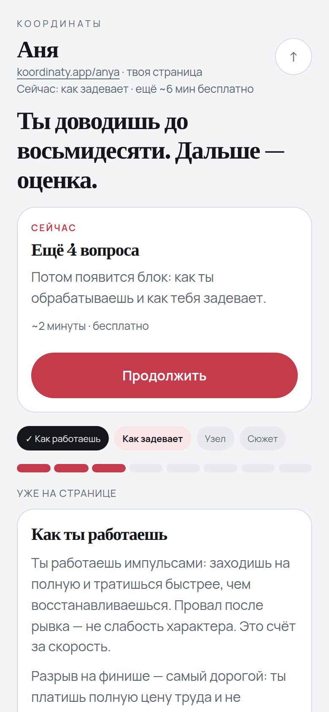 |
| Графит — тёмная, лёд | 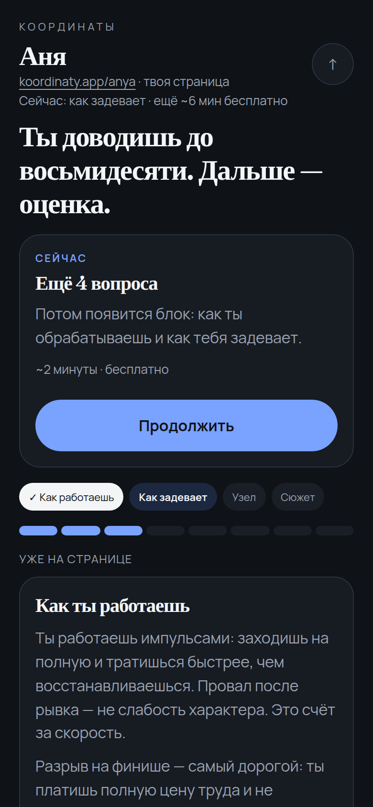 |
| Лес — туман и зелень | 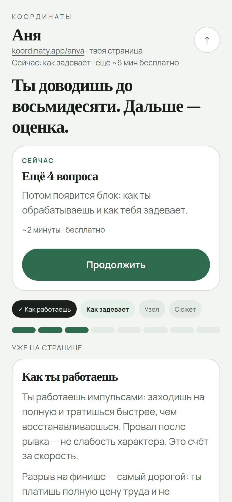 |
| Чернила — белый и фиолет | 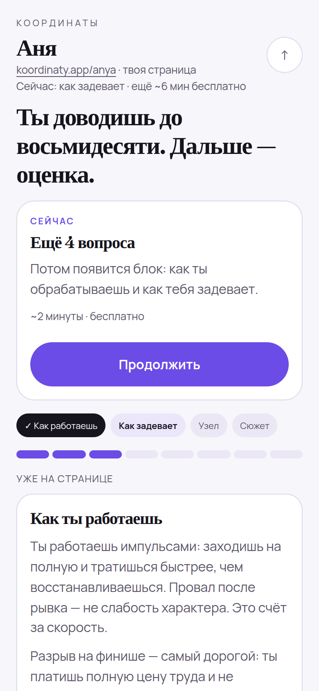 |
| Океан — серо-голубой и бирюза | 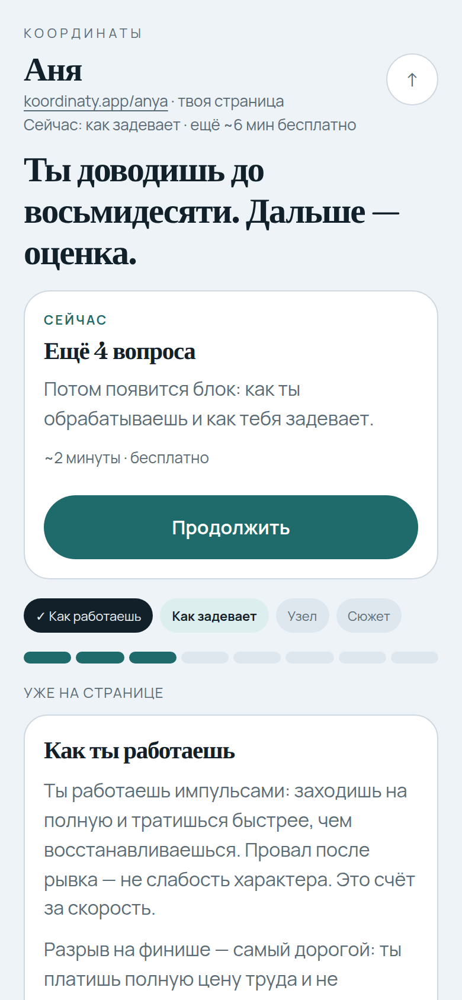 |
| Марсала — камень и вино | 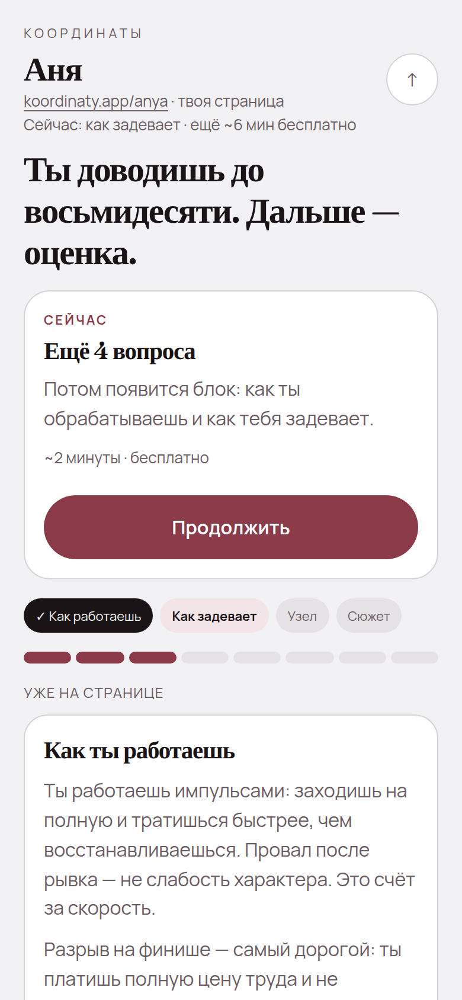 |

## Та же страница после сюжета

«Сейчас» = одно 590 ₽.

| Палитра | Кадр |
|---------|------|
| Сланец | 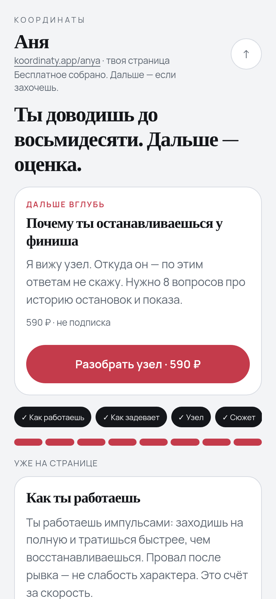 |
| Графит | 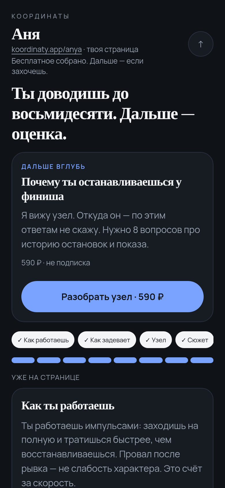 |
| Лес | 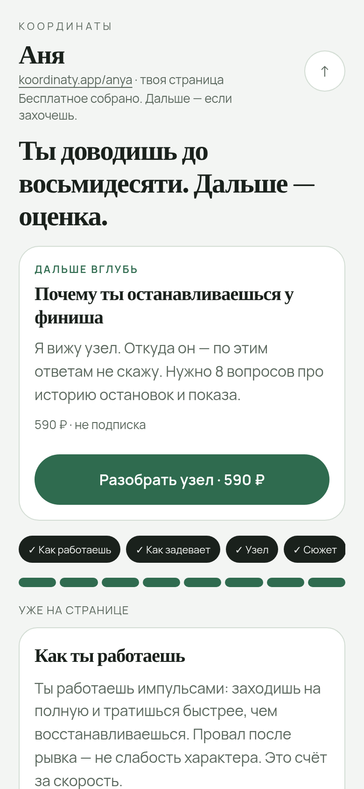 |
| Чернила | 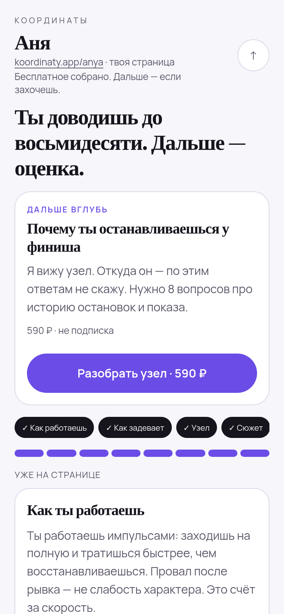 |
| Океан | 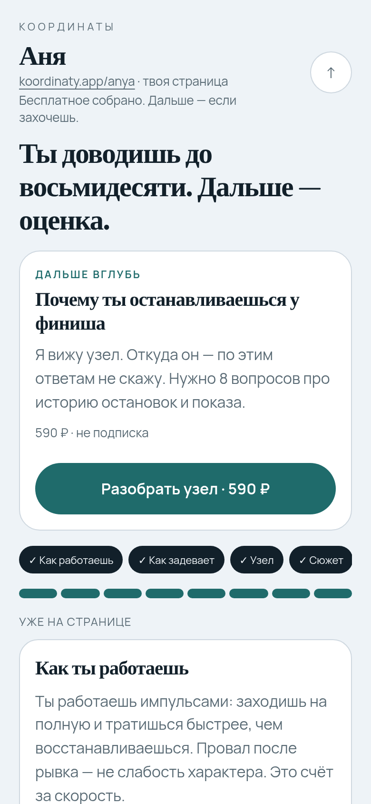 |
| Марсала | 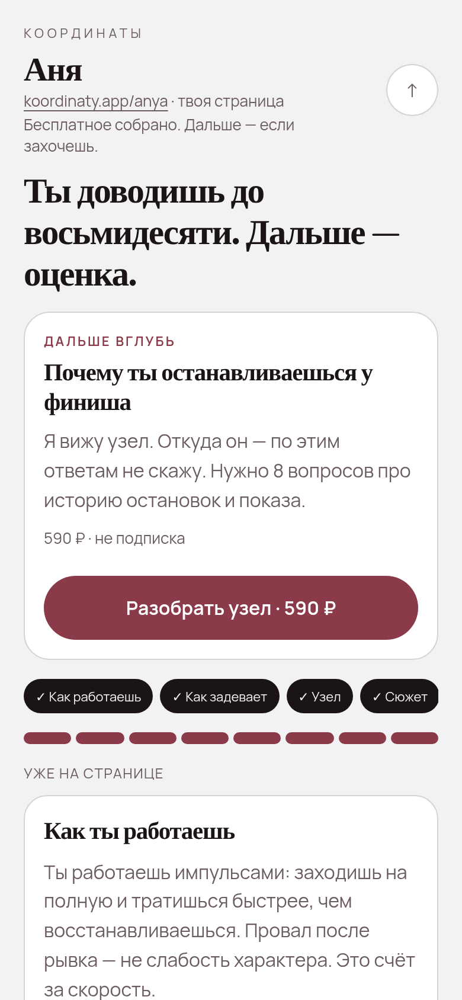 |

## Остальные экраны (Сланец)

Вход, подарок, порция, вкладка «Дальше», карта, оплата, цвет.

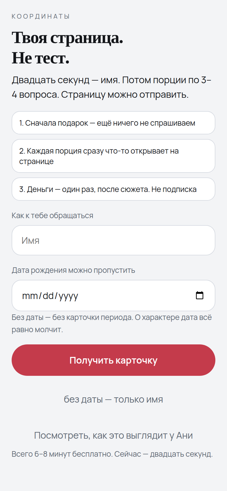
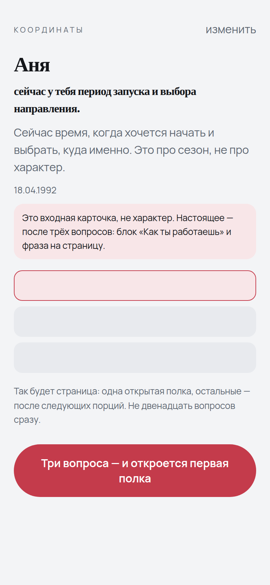
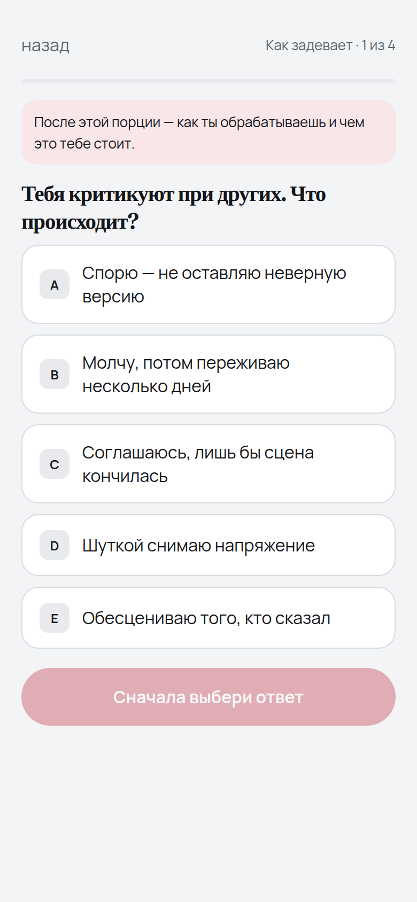
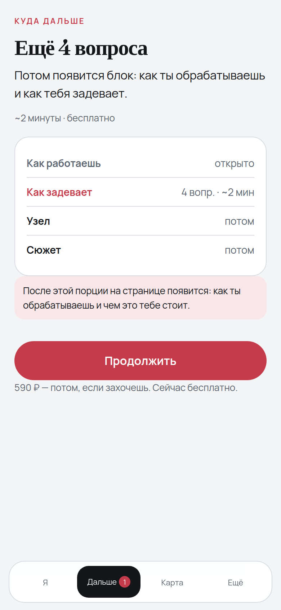
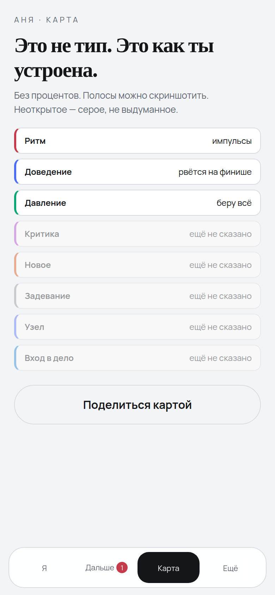
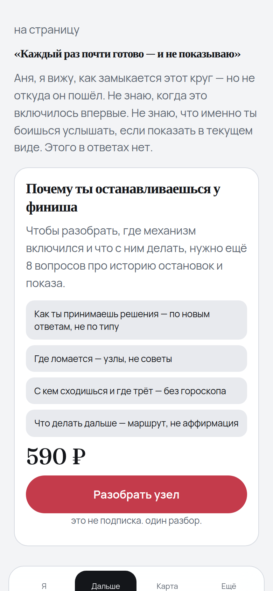
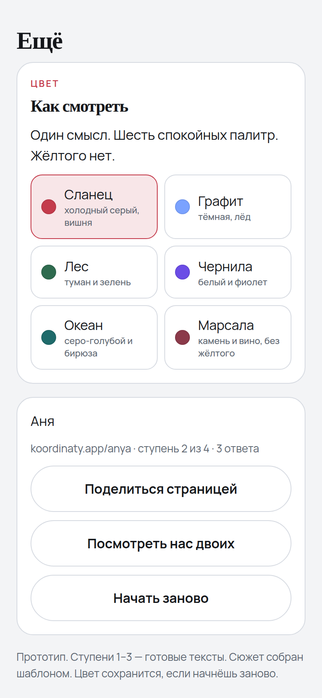

## Про настроение цвета

Папки `v2-*.png` / `v3-*.png` — генерации. Кириллица на них часто кривая, иерархия иногда уезжает в «другое приложение». Смотреть только тон. Правда — `live-*.png` и прототип.
