# 1 + 2 + 10: рабочая страница 2026

Из варианта **01** — ясный список. Из **02** — тёплая продажа. Из **10** — страница растёт, 590 ₽ не орёт, пока нет узла.

Каркас: [`docs/13-page-ux-2026.md`](../../13-page-ux-2026.md)  
Живое: [`prototype/`](../../../prototype/) — «Посмотреть, как это выглядит у Ани» открывает состояние после ступени 1.  
Цвета без жёлтого: [`../color-v2/GALLERY.md`](../color-v2/GALLERY.md)

Кадр с живого прототипа:

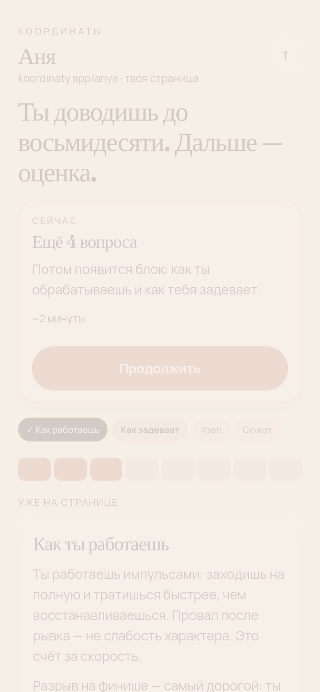

**Галерея на GitHub:**  
https://github.com/7151104/self-discovery-ai/blob/cursor/ui-mockups-ten-interfaces-e6f8/docs/ui-mockups/exploit-1210/GALLERY.md

| # | Экран | Зачем |
|---|--------|-------|
| 01 | Страница после ступени 1 | «Сейчас» = ещё 4, не оплата |
| 02 | Страница после ступени 4 | «Сейчас» = одно 590 ₽ |
| 03 | Вопросы порции | Зачем: на странице появится блок |
| 04 | Карта | Скриншот без % |
| 05 | Лист оплаты | Не витрина |
| 06 | Шаринг | Страница, не тест |
| 07 | Вход | Подарок, не анкета |
| 08 | Карточка периода | 0 характера |
| 09 | После ступени 2 | Лестница видна |
| 10 | Платный разбор | Что делать |

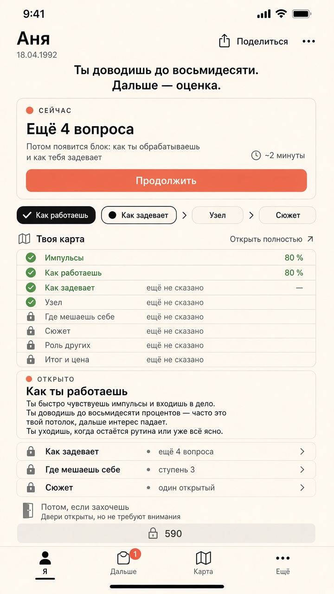
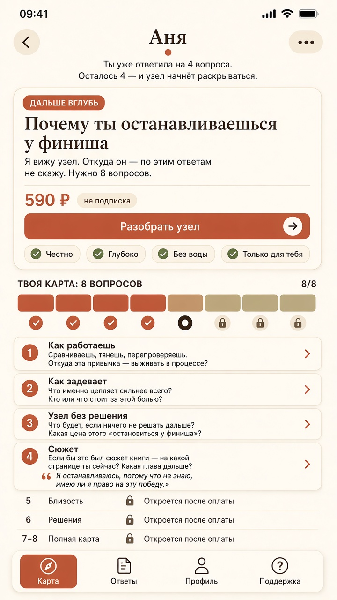
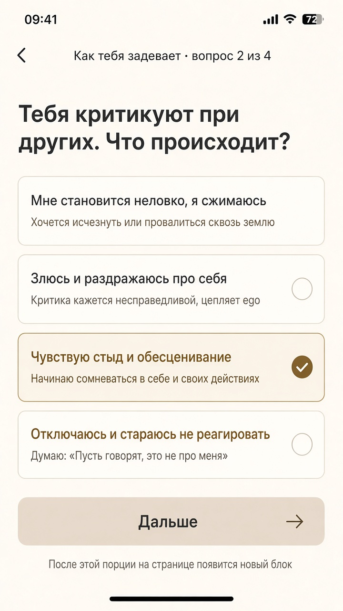
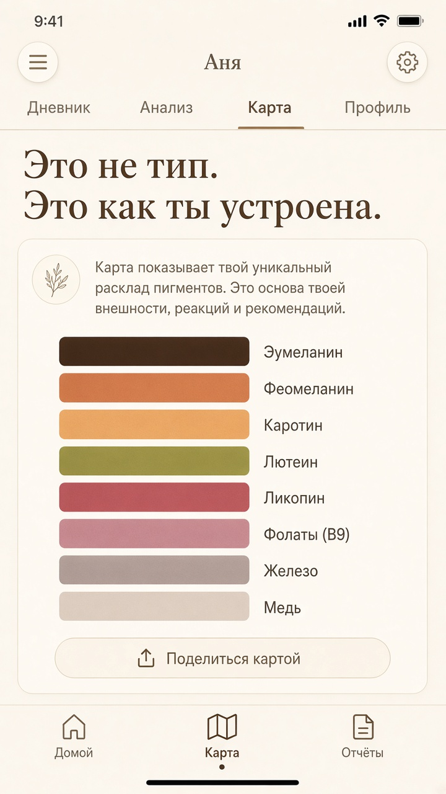
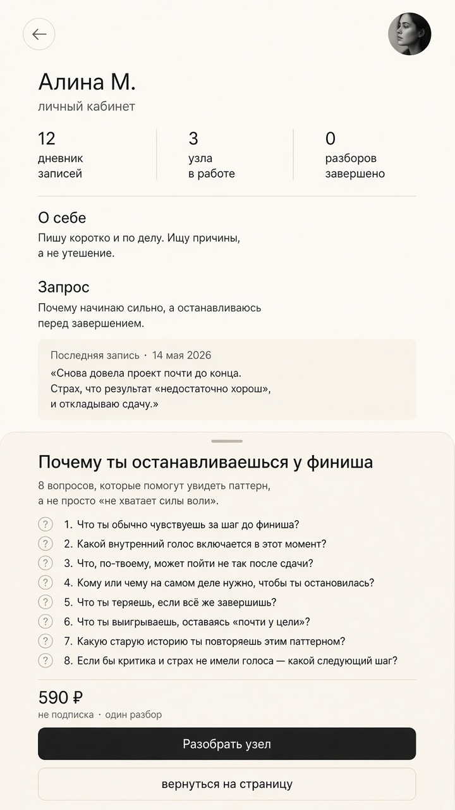
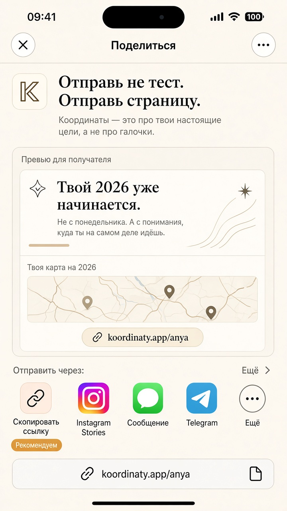
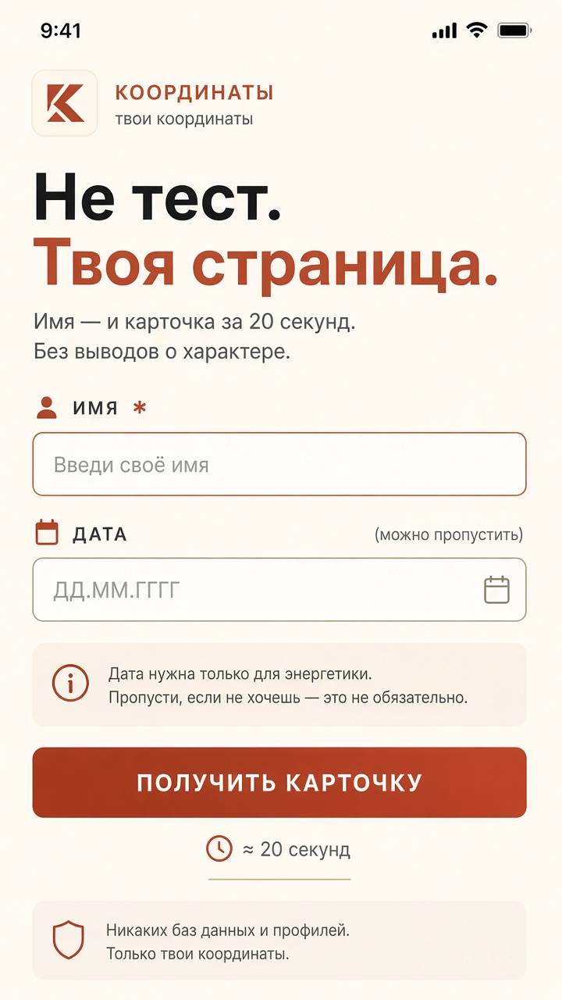
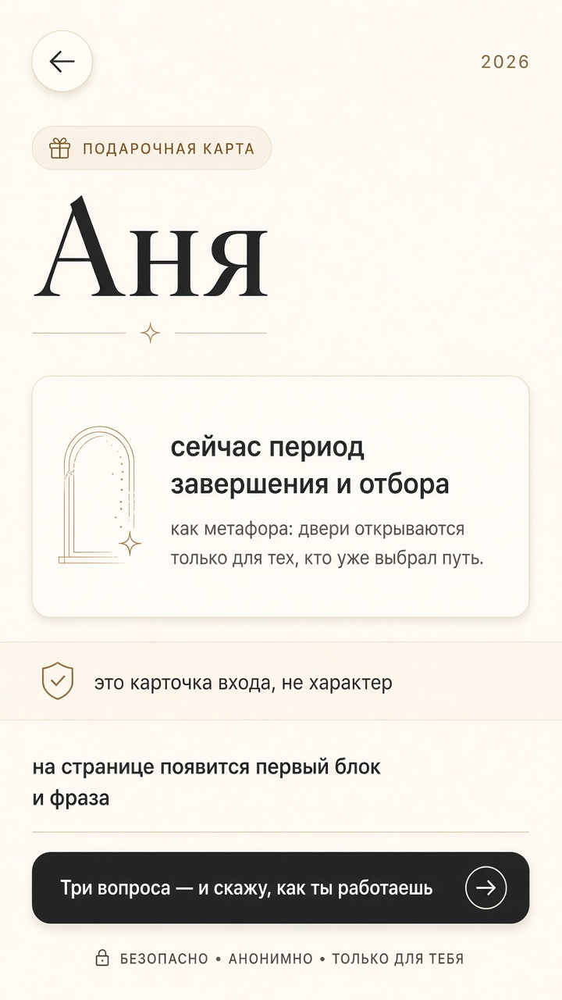
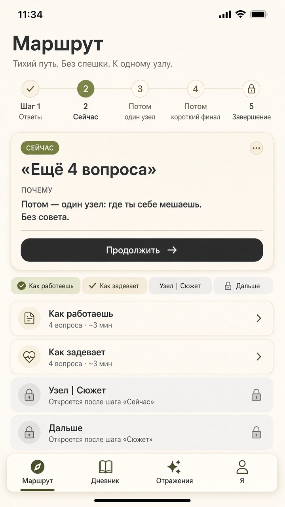
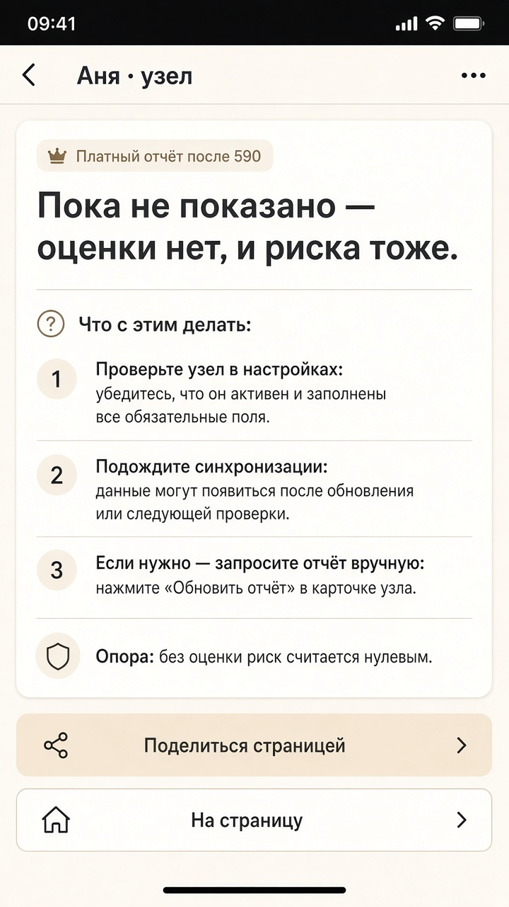
