# 10 мобильных систем

Не сжатый десктоп: у каждого варианта своя навигация, своё меню и свой способ пройти лестницу.

**Смотреть этот файл на GitHub** — картинки откроются в браузере:  
https://github.com/7151104/self-discovery-ai/blob/cursor/ui-mockups-ten-interfaces-e6f8/docs/ui-mockups/mobile-10/GALLERY.md

По три экрана на систему: дом / действие / меню или маршрут.

| # | Система | Где меню | Как идут вопросы |
|---|---------|----------|------------------|
| 01 | Страница-артефакт | На самой странице, без бургера | Порция, кнопка «ещё N» |
| 02 | Истории | Финальная сторис-карточка | Тап вправо, прогресс сверху |
| 03 | Нижние вкладки | Вкладка «Маршрут» | Вкладка «Вопросы» |
| 04 | Чат | Лист по кнопке (i) | Сообщение + чипы ответа |
| 05 | Свайп-колода | Экран «колода» | Карточка ответа влево/вправо |
| 06 | Постер + бургер | Полноэкранный индекс ≡ | Из пункта «Вопросы» |
| 07 | Мастер ступеней | Список в конце мастера | Один экран = один шаг |
| 08 | Лента вверх | Последний рил / «ещё» | Свайп вверх по блокам |
| 09 | Карта + шиты | Шиты под картой | Вопрос в нижнем шите |
| 10 | Нативный iOS | Вкладка «Ещё» | Push-экран ступени |

---

## 01. Страница-артефакт

Продукт = одна живая страница. Меню нет: функции лежат внизу скролла. Лучше всего скриншотится.

**Функции на странице:** поделиться, ссылка, закрытые двери, одно предложение 590 ₽, «ещё N вопросов».

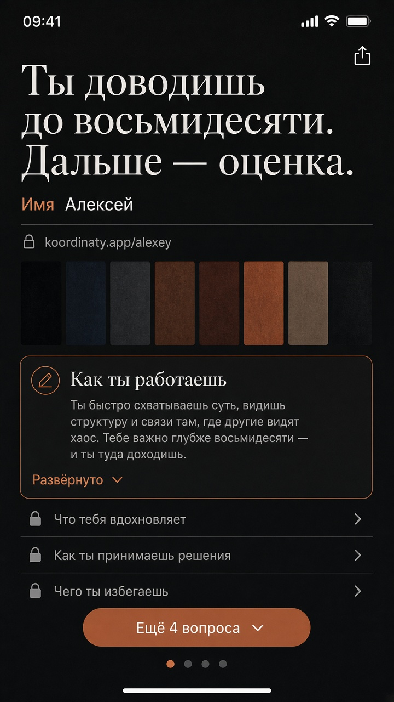
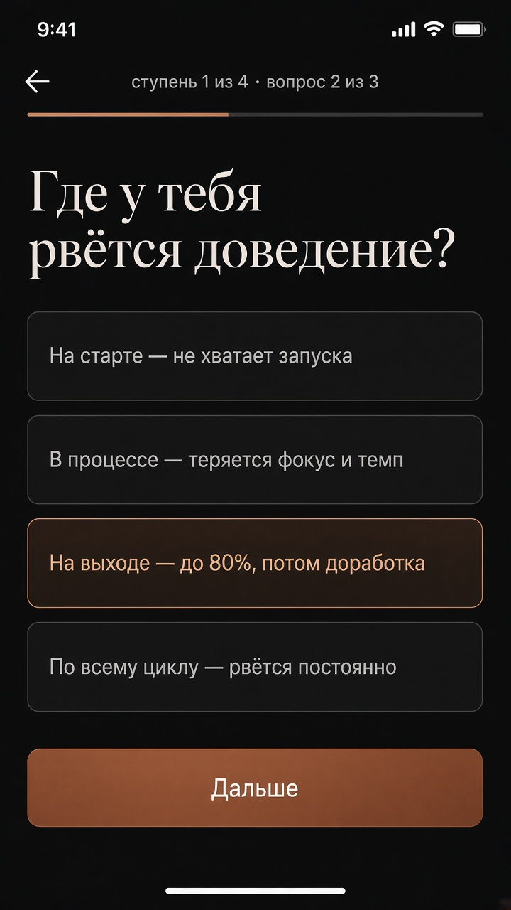
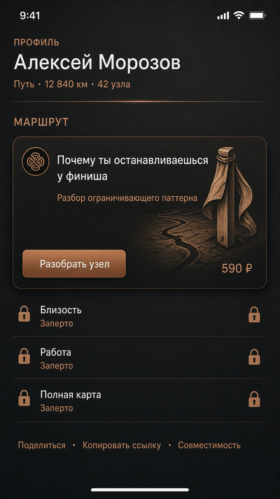

[кабинет](https://github.com/7151104/self-discovery-ai/blob/cursor/ui-mockups-ten-interfaces-e6f8/docs/ui-mockups/mobile-10/m01a-artifact-cabinet.png) · [вопрос](https://github.com/7151104/self-discovery-ai/blob/cursor/ui-mockups-ten-interfaces-e6f8/docs/ui-mockups/mobile-10/m01b-artifact-question.png) · [маршрут](https://github.com/7151104/self-discovery-ai/blob/cursor/ui-mockups-ten-interfaces-e6f8/docs/ui-mockups/mobile-10/m01c-artifact-route.png)

---

## 02. Истории

Как сторис: полный экран, тап по краям, полоски сверху. Вход лёгкий. Страница собирается из просмотренных сторис.

**Меню** = последняя сторис «что дальше»: страница, шаринг, узел, карта.

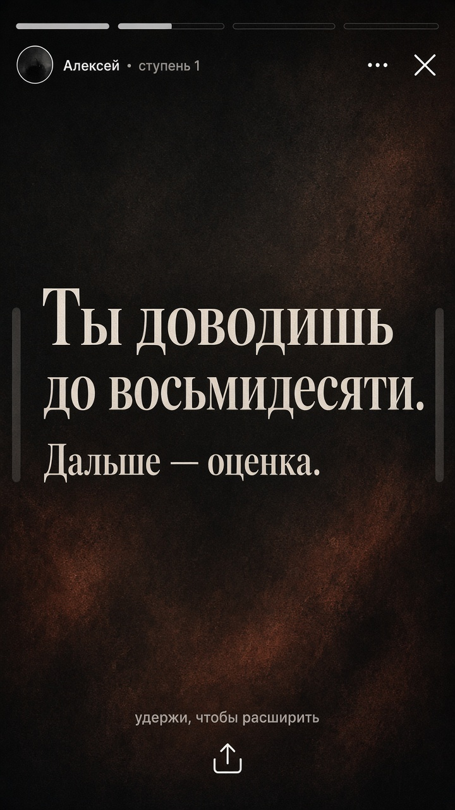
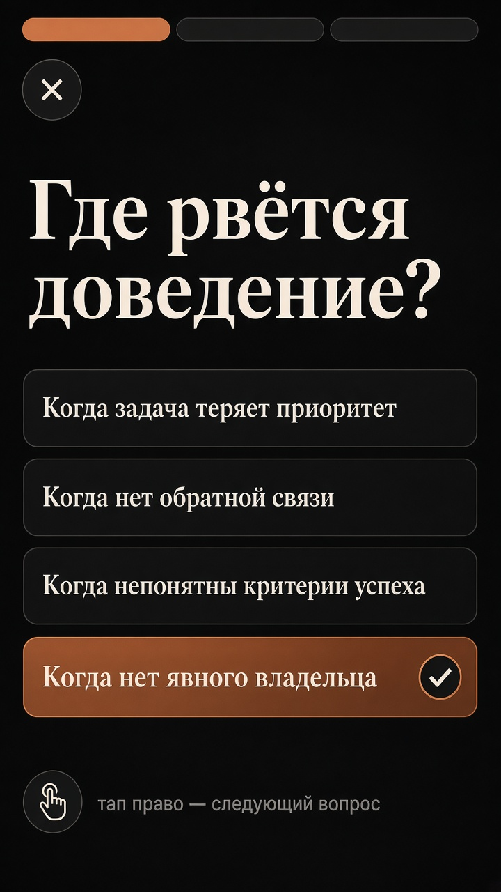
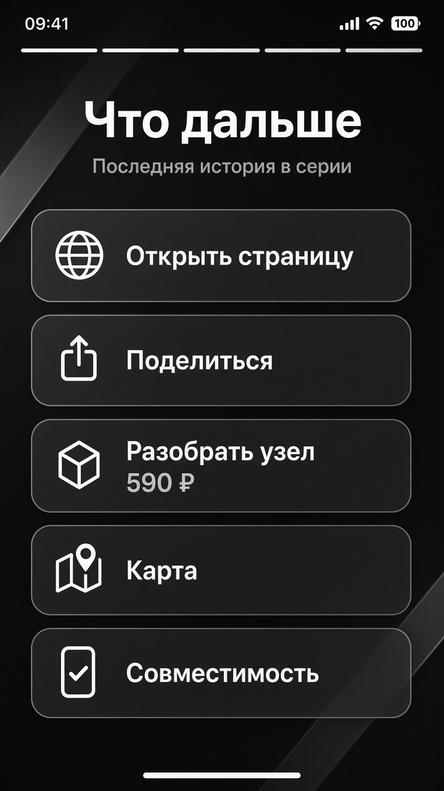

[инсайт](https://github.com/7151104/self-discovery-ai/blob/cursor/ui-mockups-ten-interfaces-e6f8/docs/ui-mockups/mobile-10/m02a-stories-insight.png) · [вопрос](https://github.com/7151104/self-discovery-ai/blob/cursor/ui-mockups-ten-interfaces-e6f8/docs/ui-mockups/mobile-10/m02b-stories-question.png) · [меню](https://github.com/7151104/self-discovery-ai/blob/cursor/ui-mockups-ten-interfaces-e6f8/docs/ui-mockups/mobile-10/m02c-stories-menu.png)

---

## 03. Нижние вкладки

Привычная схема телефона. Четыре якоря всегда внизу.

**Вкладки:** Я · Вопросы · Карта · Маршрут.  
**Меню функций** = вкладка «Маршрут», не бургер. Бейдж на «Вопросах», когда есть недоигранная порция.

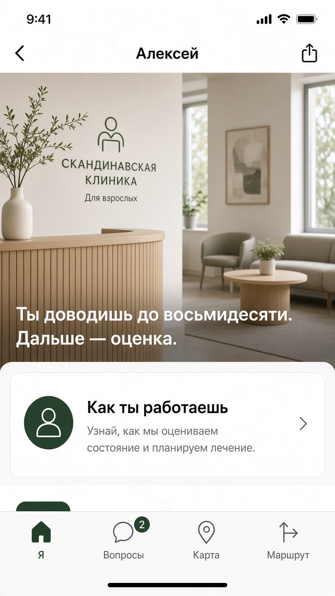
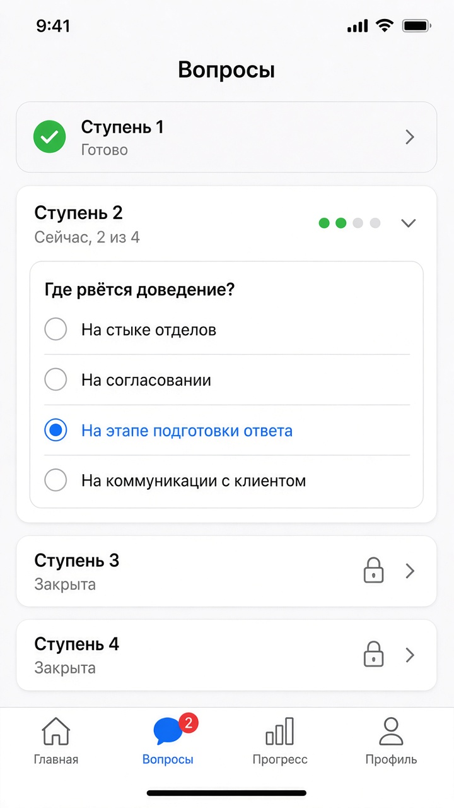
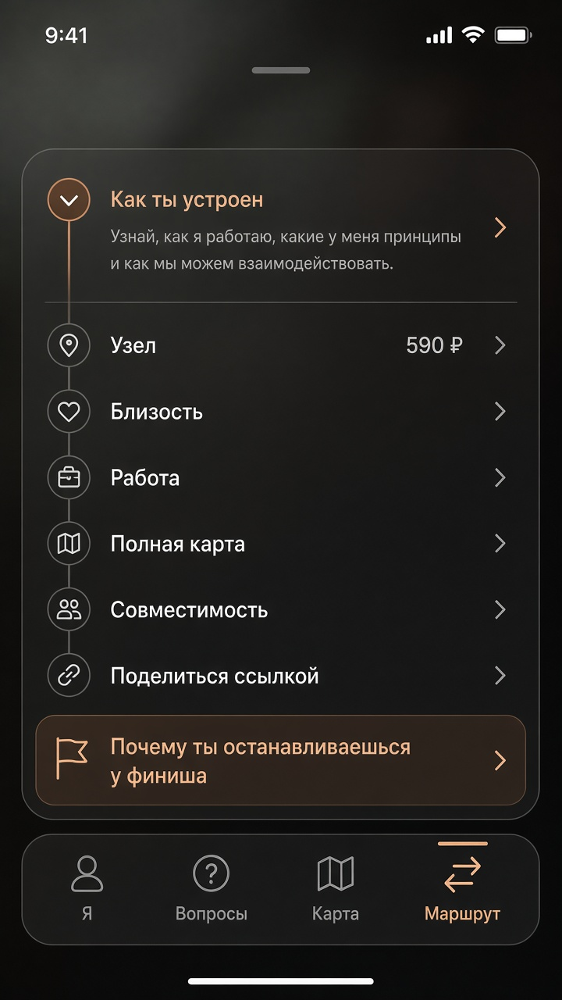

[я](https://github.com/7151104/self-discovery-ai/blob/cursor/ui-mockups-ten-interfaces-e6f8/docs/ui-mockups/mobile-10/m03a-tabs-me.png) · [вопросы](https://github.com/7151104/self-discovery-ai/blob/cursor/ui-mockups-ten-interfaces-e6f8/docs/ui-mockups/mobile-10/m03b-tabs-questions.png) · [маршрут](https://github.com/7151104/self-discovery-ai/blob/cursor/ui-mockups-ten-interfaces-e6f8/docs/ui-mockups/mobile-10/m03c-tabs-route.png)

---

## 04. Чат

Сервис пишет. Ответы — чипы над клавиатурой. Знакомый жест.

**Меню** = лист «о чате» (кнопка i): страница, карта, узел, совместимость, шаринг. Разбор приходит карточкой в тред.

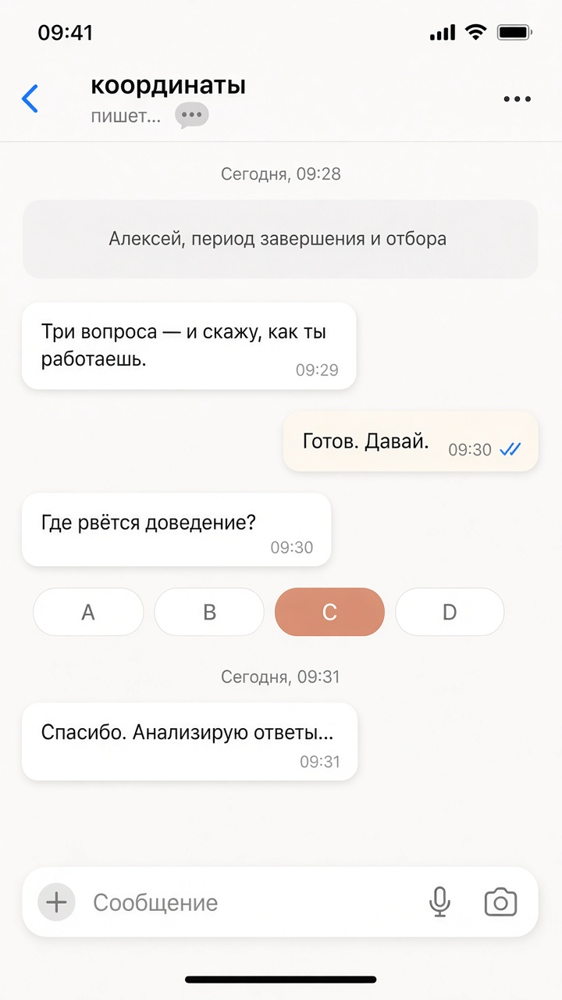
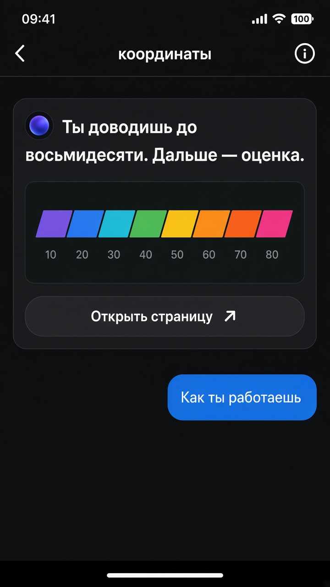
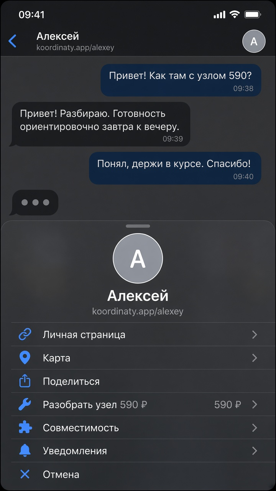

[тред](https://github.com/7151104/self-discovery-ai/blob/cursor/ui-mockups-ten-interfaces-e6f8/docs/ui-mockups/mobile-10/m04a-chat-thread.png) · [инсайт](https://github.com/7151104/self-discovery-ai/blob/cursor/ui-mockups-ten-interfaces-e6f8/docs/ui-mockups/mobile-10/m04b-chat-insight.png) · [меню](https://github.com/7151104/self-discovery-ai/blob/cursor/ui-mockups-ten-interfaces-e6f8/docs/ui-mockups/mobile-10/m04c-chat-menu.png)

---

## 05. Свайп-колода

Вопрос = карточка. «Про меня / не про меня». После — стопка блоков, которые листаешь.

**Меню** = экран «колода»: все функции как карты, без списка настроек.

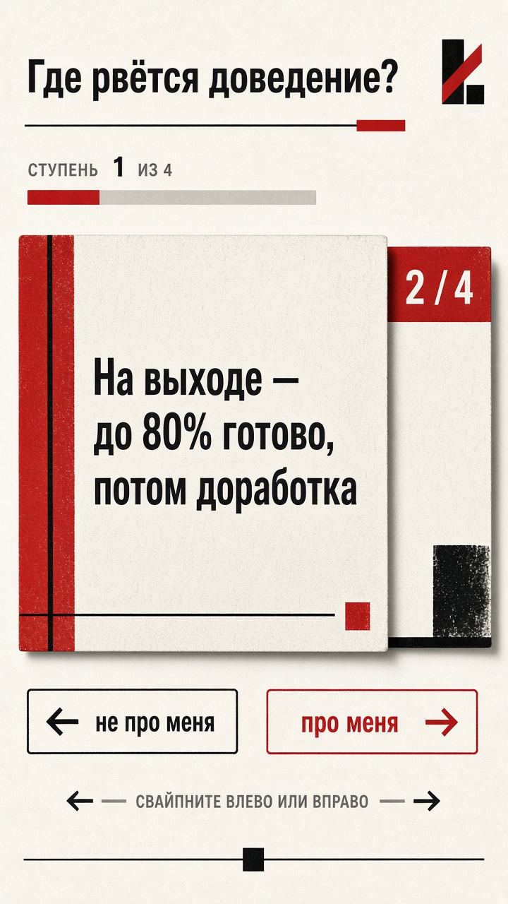
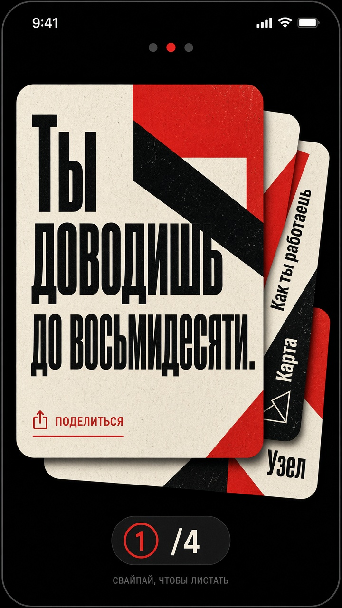
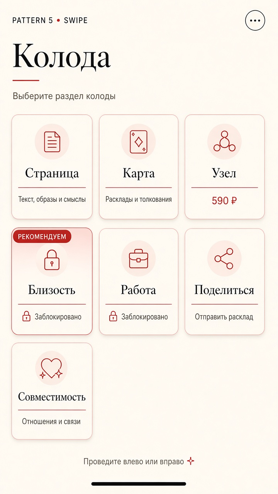

[вопрос](https://github.com/7151104/self-discovery-ai/blob/cursor/ui-mockups-ten-interfaces-e6f8/docs/ui-mockups/mobile-10/m05a-swipe-question.png) · [стопка](https://github.com/7151104/self-discovery-ai/blob/cursor/ui-mockups-ten-interfaces-e6f8/docs/ui-mockups/mobile-10/m05b-swipe-stack.png) · [колода](https://github.com/7151104/self-discovery-ai/blob/cursor/ui-mockups-ten-interfaces-e6f8/docs/ui-mockups/mobile-10/m05c-swipe-deck.png)

---

## 06. Постер + бургер

Дом — постер для скриншота. Всё остальное спрятано за ≡.

**Меню** = полный индекс: страница, вопросы, карта, срезы, шаринг. Сильная виральность, слабее discoverability функций.

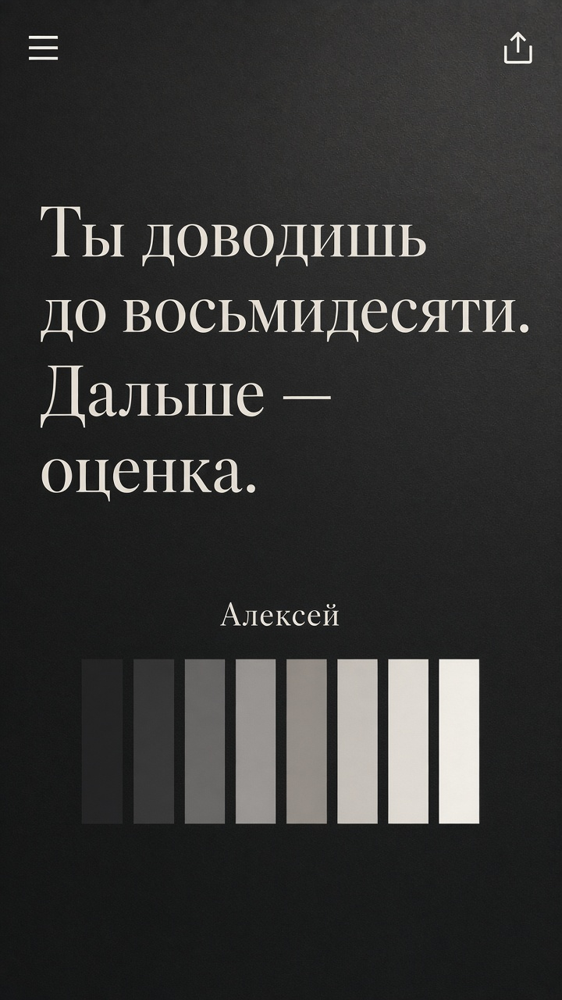
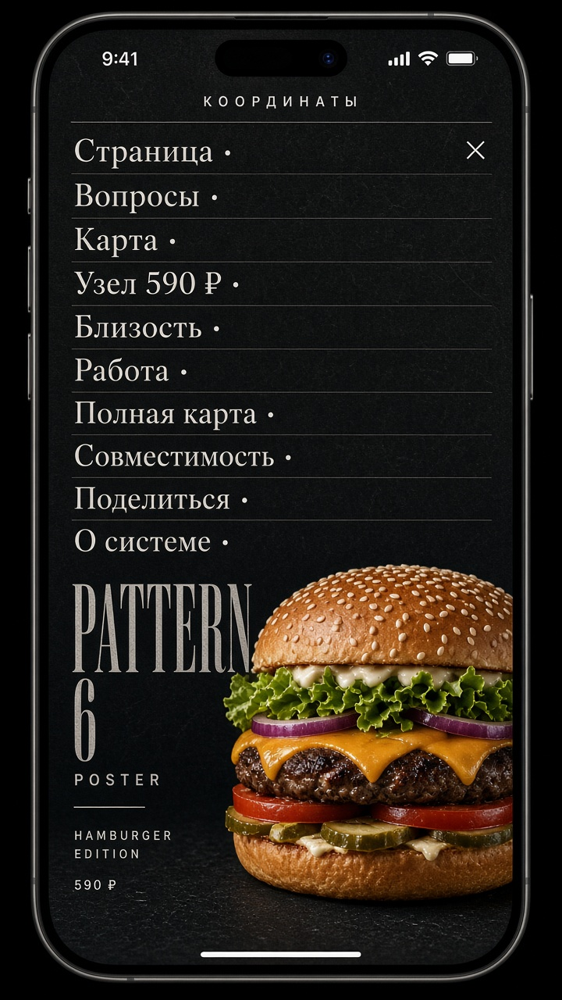
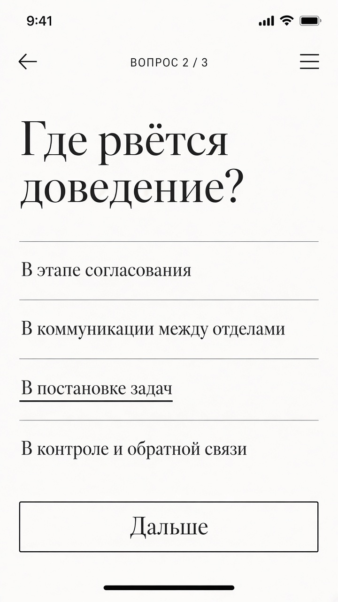

[постер](https://github.com/7151104/self-discovery-ai/blob/cursor/ui-mockups-ten-interfaces-e6f8/docs/ui-mockups/mobile-10/m06a-poster-home.png) · [меню](https://github.com/7151104/self-discovery-ai/blob/cursor/ui-mockups-ten-interfaces-e6f8/docs/ui-mockups/mobile-10/m06b-poster-menu.png) · [вопрос](https://github.com/7151104/self-discovery-ai/blob/cursor/ui-mockups-ten-interfaces-e6f8/docs/ui-mockups/mobile-10/m06c-poster-question.png)

---

## 07. Мастер ступеней

Как системный онбординг: шаг 0 → 1 → 2 → 3 → 4. Потом список-кабинет.

**Меню** появляется только в конце, как список дверей. Самый понятный вход, меньше ощущения «живой страницы» на старте.

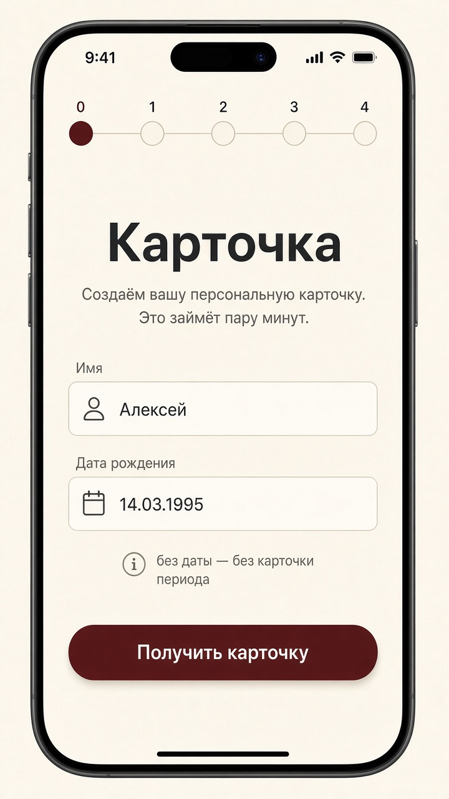
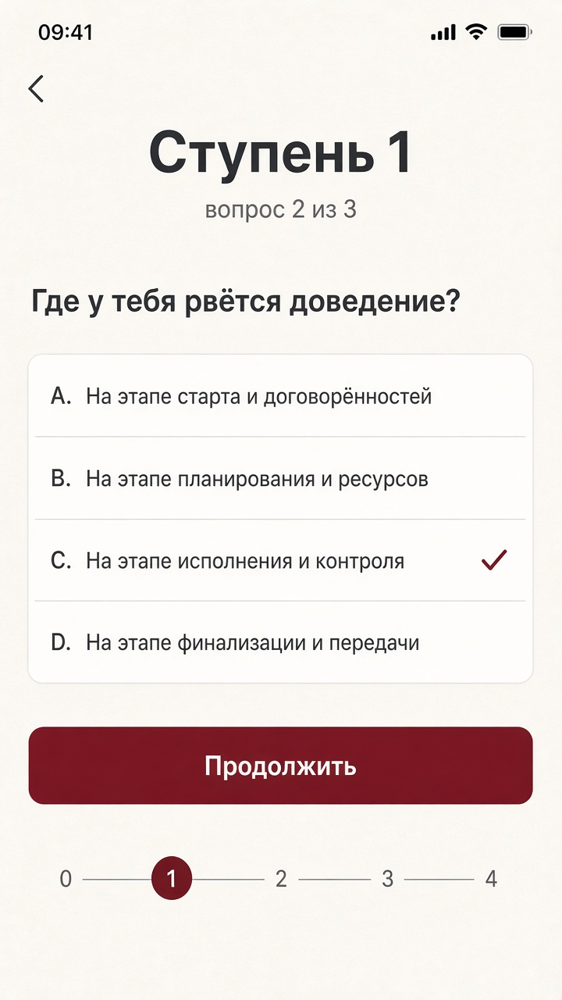
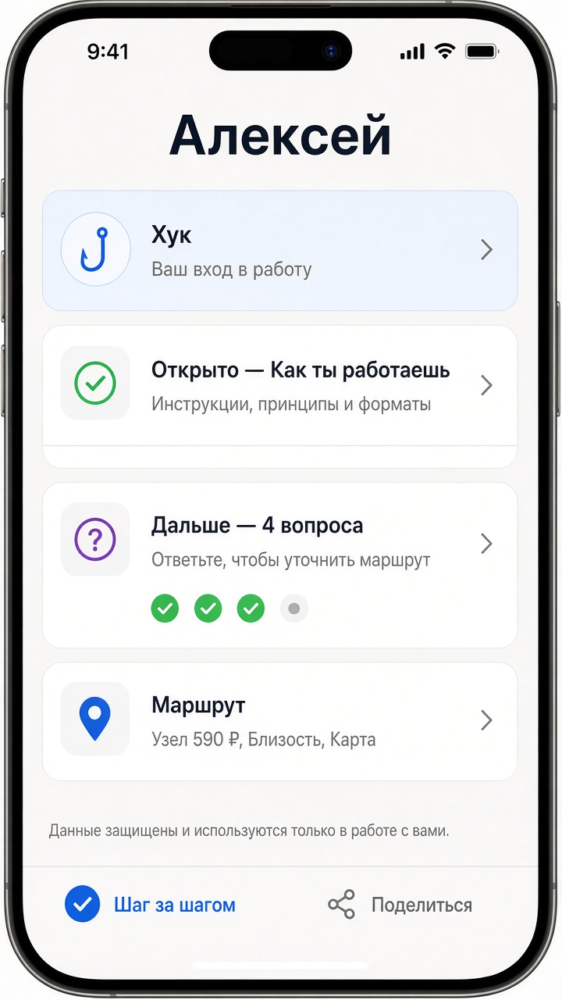

[вход](https://github.com/7151104/self-discovery-ai/blob/cursor/ui-mockups-ten-interfaces-e6f8/docs/ui-mockups/mobile-10/m07a-wizard-welcome.png) · [вопрос](https://github.com/7151104/self-discovery-ai/blob/cursor/ui-mockups-ten-interfaces-e6f8/docs/ui-mockups/mobile-10/m07b-wizard-question.png) · [кабинет](https://github.com/7151104/self-discovery-ai/blob/cursor/ui-mockups-ten-interfaces-e6f8/docs/ui-mockups/mobile-10/m07c-wizard-cabinet.png)

---

## 08. Лента вверх

Один блок = один экран. Свайп вверх как в рилсах. Хук, «как работаешь», узел, двери.

**Меню** = последний рил или кнопка «ещё» на рейле справа: шаринг, карта, 590 ₽.

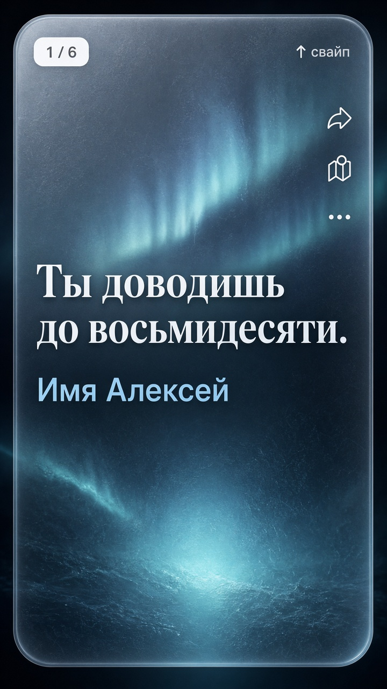
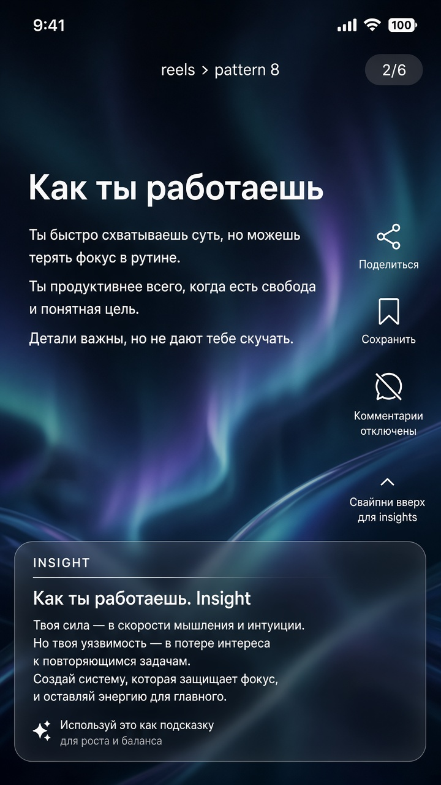
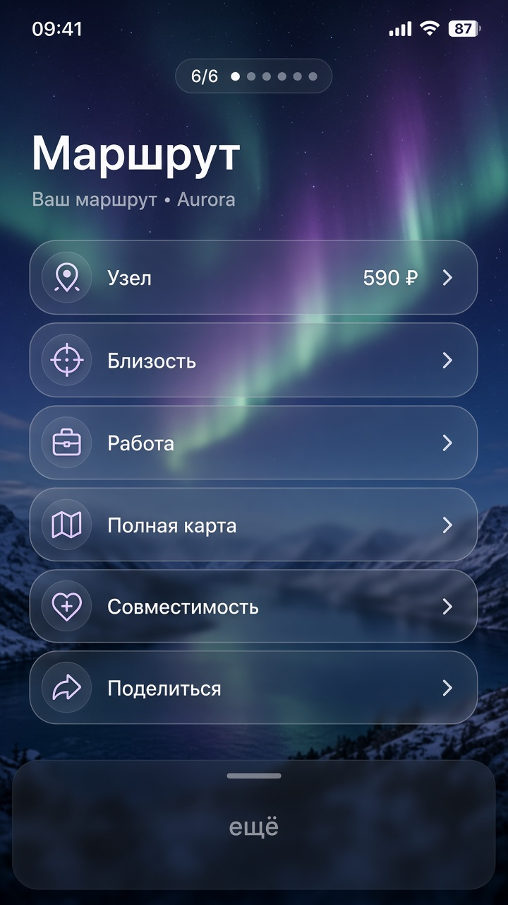

[хук](https://github.com/7151104/self-discovery-ai/blob/cursor/ui-mockups-ten-interfaces-e6f8/docs/ui-mockups/mobile-10/m08a-reels-hook.png) · [блок](https://github.com/7151104/self-discovery-ai/blob/cursor/ui-mockups-ten-interfaces-e6f8/docs/ui-mockups/mobile-10/m08b-reels-block.png) · [меню](https://github.com/7151104/self-discovery-ai/blob/cursor/ui-mockups-ten-interfaces-e6f8/docs/ui-mockups/mobile-10/m08c-reels-menu.png)

---

## 09. Карта + нижние шиты

Карта из 8 полос всегда сверху. Контент и меню — нижние шиты, которые тянешь.

**Меню** не перекрывает артефакт: функции в шите, карта остаётся. Хорошо для «я вижу себя, пока отвечаю».

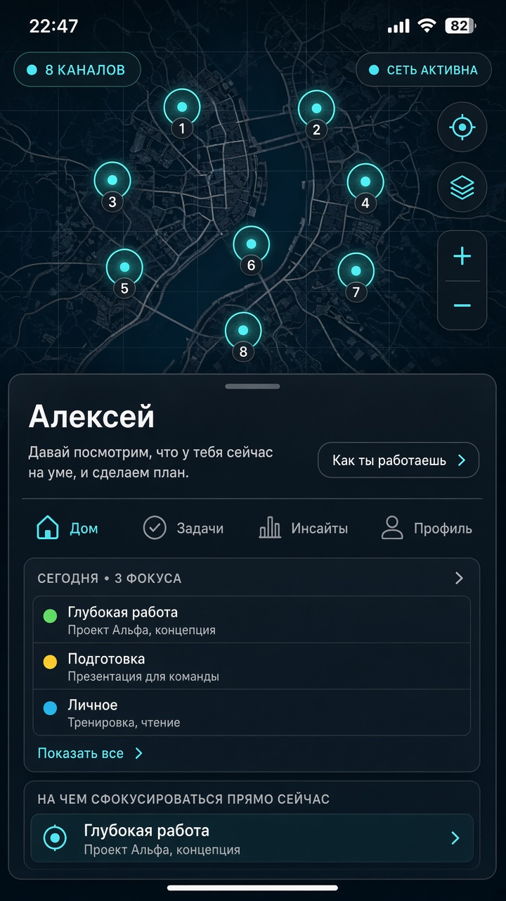
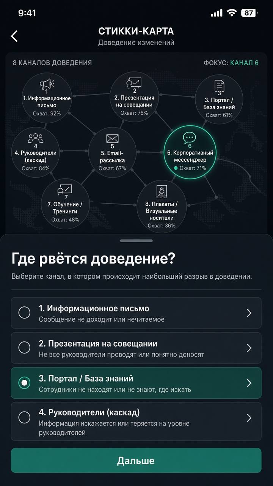
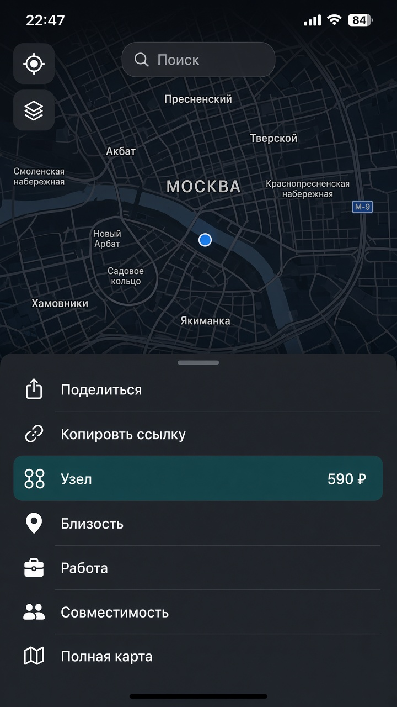

[дом](https://github.com/7151104/self-discovery-ai/blob/cursor/ui-mockups-ten-interfaces-e6f8/docs/ui-mockups/mobile-10/m09a-sheet-home.png) · [вопрос](https://github.com/7151104/self-discovery-ai/blob/cursor/ui-mockups-ten-interfaces-e6f8/docs/ui-mockups/mobile-10/m09b-sheet-question.png) · [меню](https://github.com/7151104/self-discovery-ai/blob/cursor/ui-mockups-ten-interfaces-e6f8/docs/ui-mockups/mobile-10/m09c-sheet-menu.png)

---

## 10. Нативный iOS

Крупные заголовки, grouped lists, вкладка «Ещё» как в системных приложениях. Самый скучный — и самый понятный.

**Меню «Ещё»:** профиль, ссылка, шаринг, маршрут срезов, уведомления, тема. Вопросы — отдельный push.

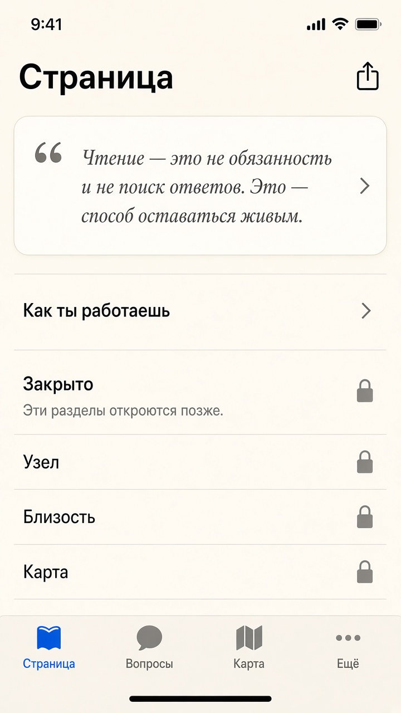
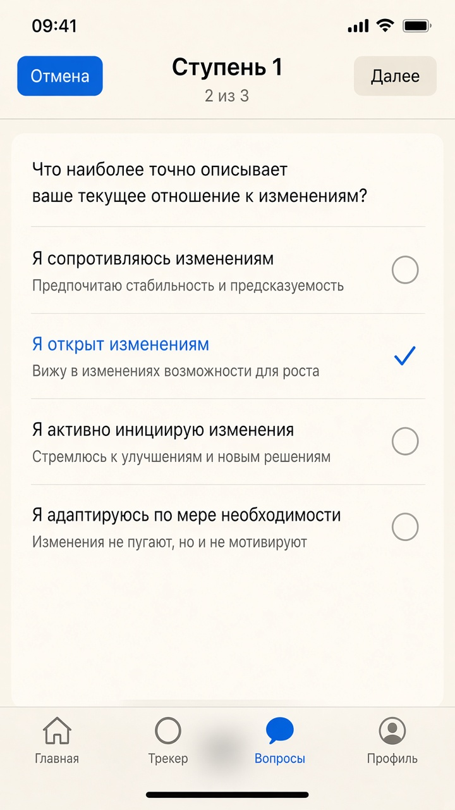
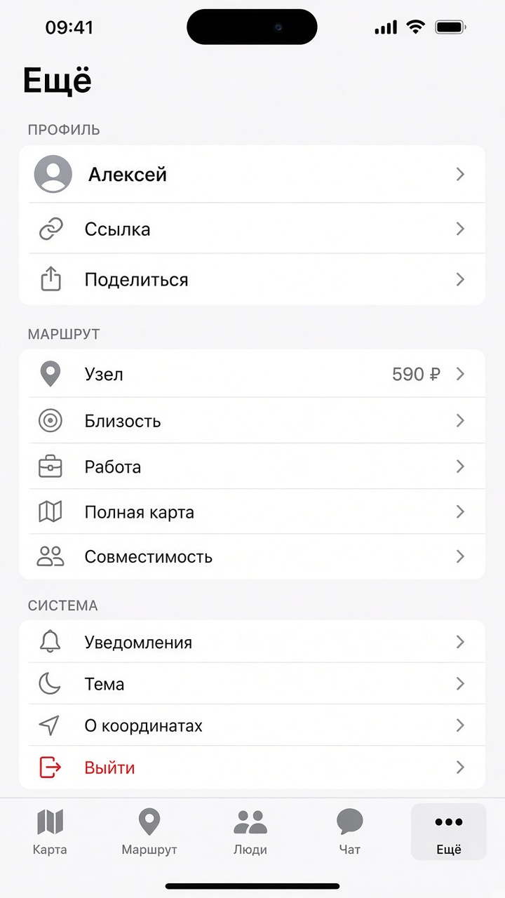

[страница](https://github.com/7151104/self-discovery-ai/blob/cursor/ui-mockups-ten-interfaces-e6f8/docs/ui-mockups/mobile-10/m10a-ios-page.png) · [вопрос](https://github.com/7151104/self-discovery-ai/blob/cursor/ui-mockups-ten-interfaces-e6f8/docs/ui-mockups/mobile-10/m10b-ios-question.png) · [ещё](https://github.com/7151104/self-discovery-ai/blob/cursor/ui-mockups-ten-interfaces-e6f8/docs/ui-mockups/mobile-10/m10c-ios-more.png)

---

## Что брать в прототип

На телефоне почти наверняка побеждает **гибрид 01 + 03 + 10**:

1. Дом — страница-артефакт (скриншот, хук, карта, двери).
2. Низ — две-четыре вкладки, не десять пунктов в бургере.
3. Вопросы — отдельный поток на большой палец, порциями.
4. «Ещё» — совместимость, тема, выход. Платные двери живут на странице и во вкладке «Маршрут», не в настройках.

Не тащить в MVP чат, рилсы и свайп как основу: они хороши как эксперимент входа, но ломают закон «живая страница на домене».

Это концепт-арт. Кириллица и лишние вкладки в генерации могут плыть. Канон — `docs/05-user-journey.md`.
