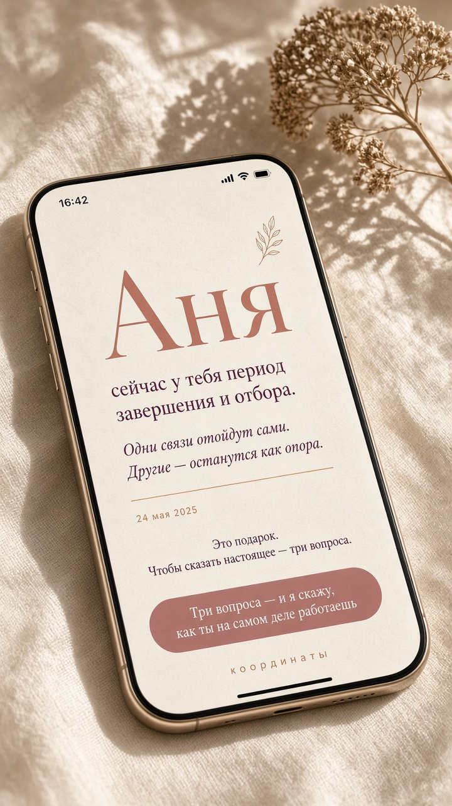
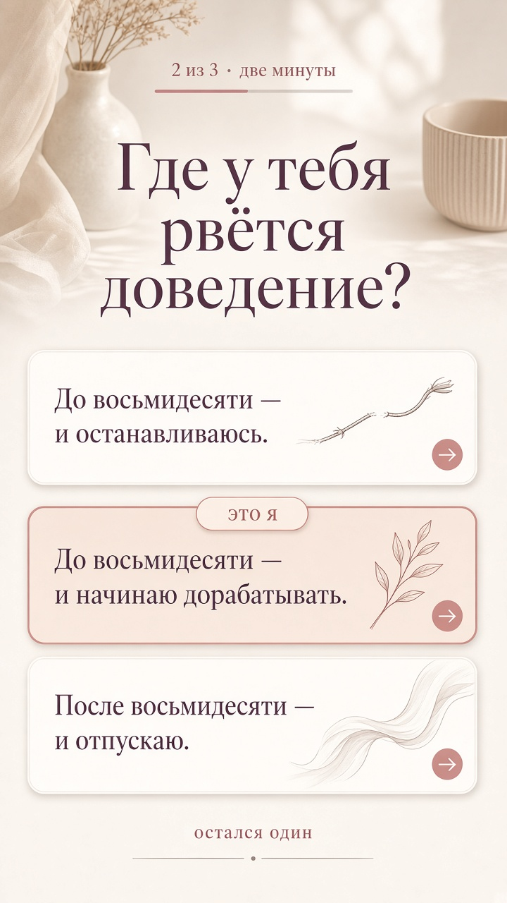
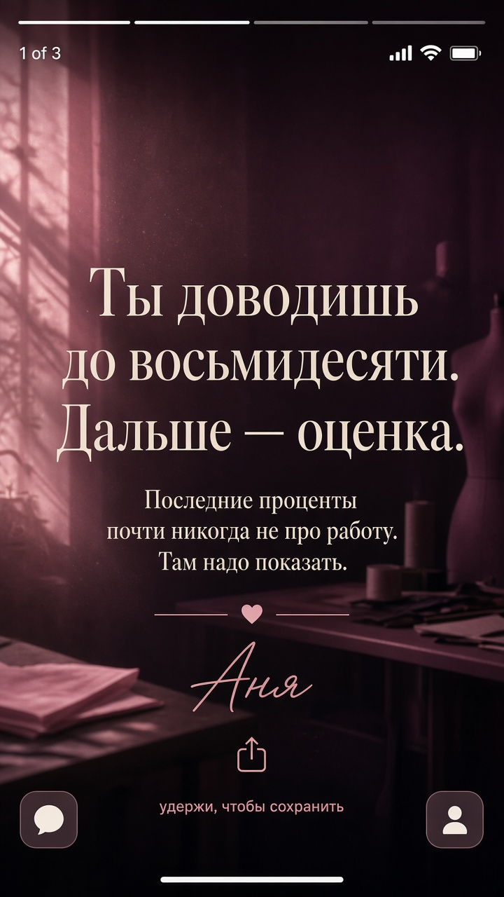
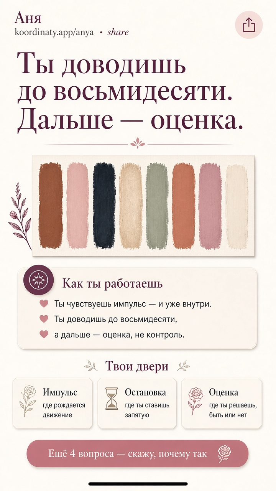
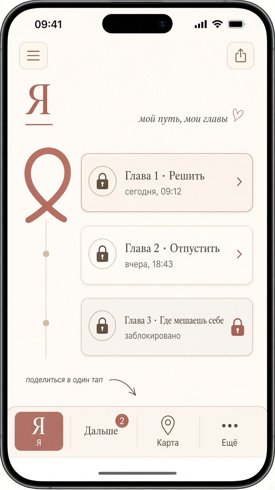
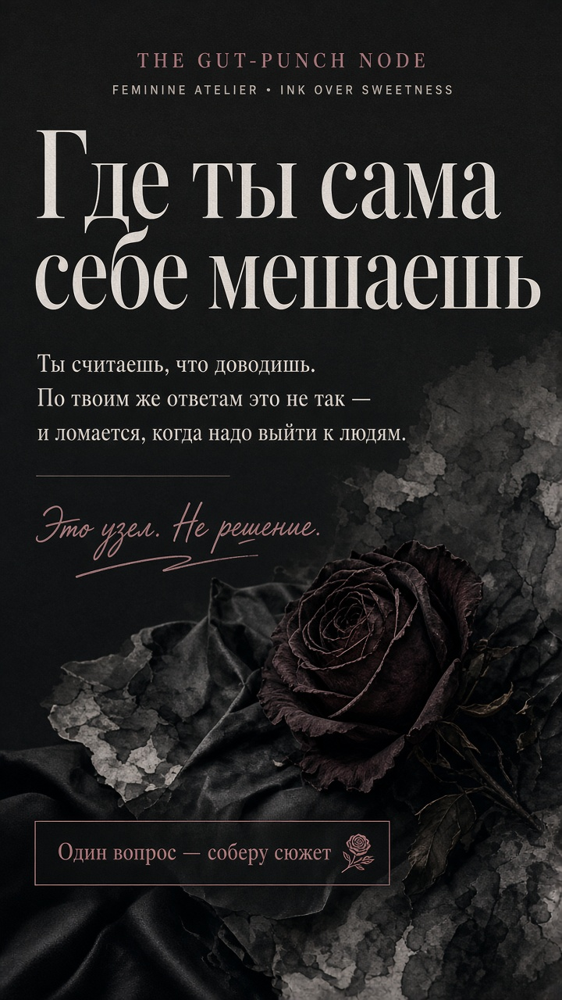
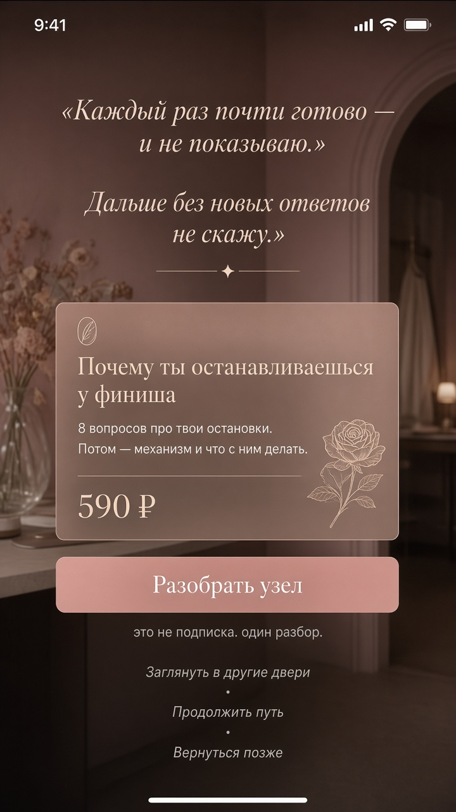
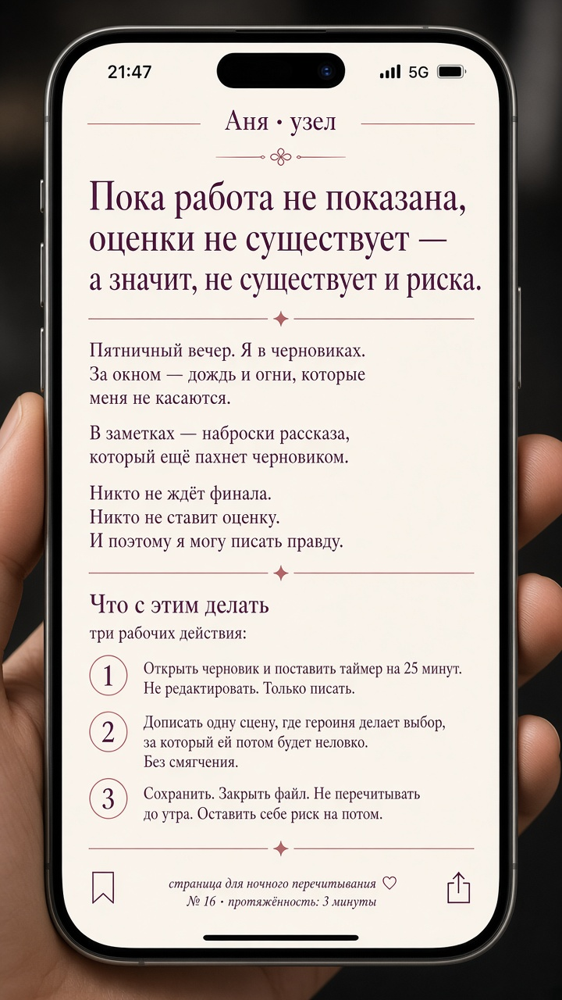
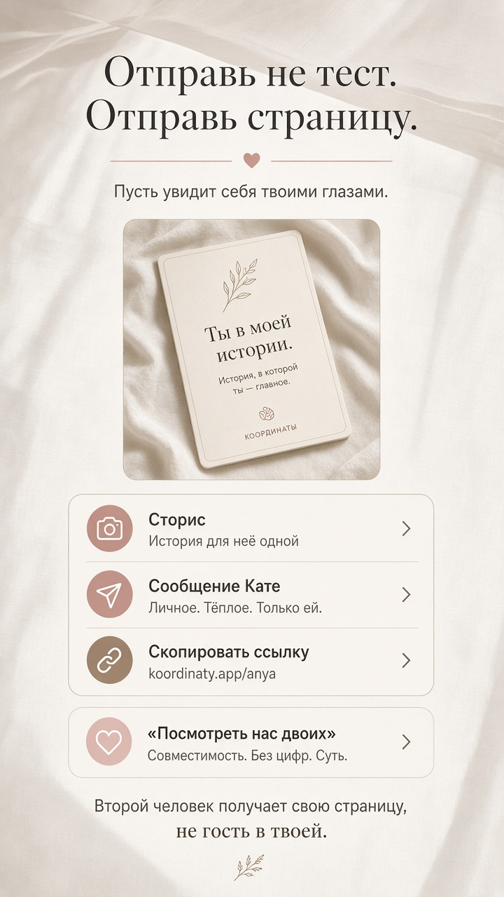
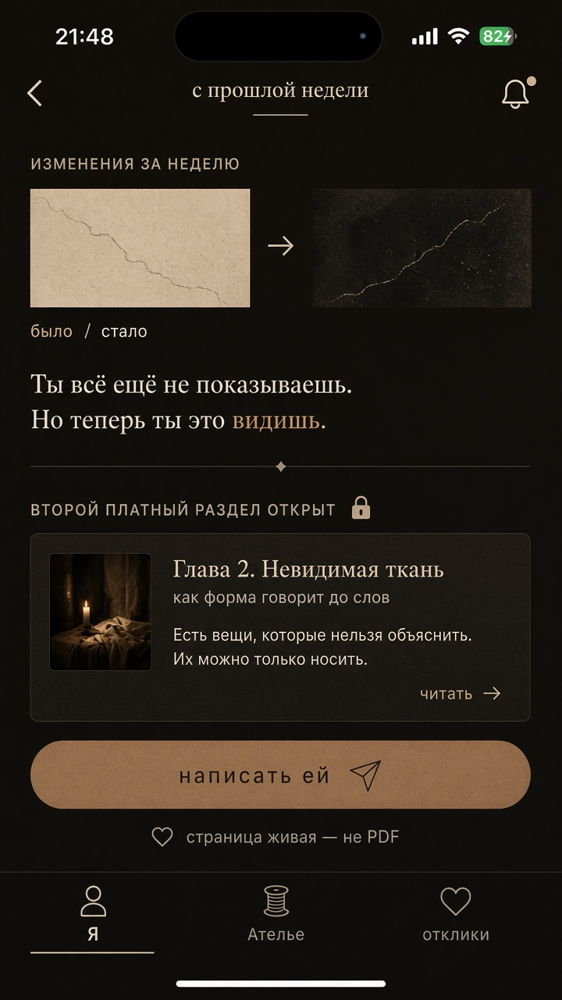

# Усиленный мобильный продукт

Одна система из лучших 1 + 2 + 3 + 5. Женская аудитория, телефон, воронка до оплаты и пересылки.

**Смотреть на GitHub:**  
https://github.com/7151104/self-discovery-ai/blob/cursor/ui-mockups-ten-interfaces-e6f8/docs/ui-mockups/mobile-strong/GALLERY.md

Логика воронки простыми словами: [`docs/11-funnel-plain-language.md`](../../11-funnel-plain-language.md)

Герой макетов — **Аня**. Не потому что продукт только для женщин, а потому что так выглядит основной вход.

| # | Экран | Роль в воронке |
|---|--------|----------------|
| 01 | Подарок | 20 секунд, ещё ничего не спросила |
| 02 | Вопрос | Отвечать как «это я», не как анкета |
| 03 | Сторис-удар | Первое узнавание, уезжает в сторис |
| 04 | Страница | Объект, который пересылают |
| 05 | Вкладки | Завтра есть куда вернуться |
| 06 | Узел | Рана без пластыря |
| 07 | 590 ₽ | Одна дверь, желание, не витрина |
| 08 | После оплаты | «Открыла глаза», есть что рассказать |
| 09 | Отправь ей | Вирус: страница, не «пройди тест» |
| 10 | Через неделю | Страница живая, повторный заход |

