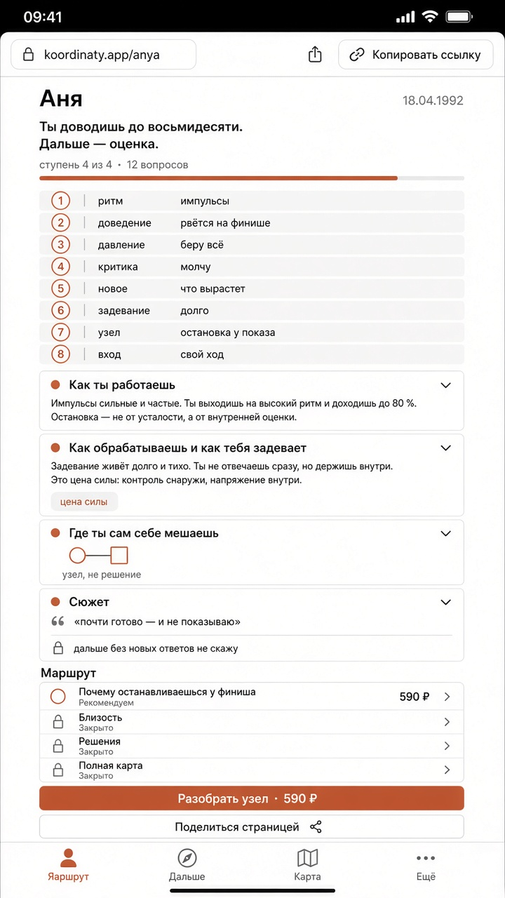
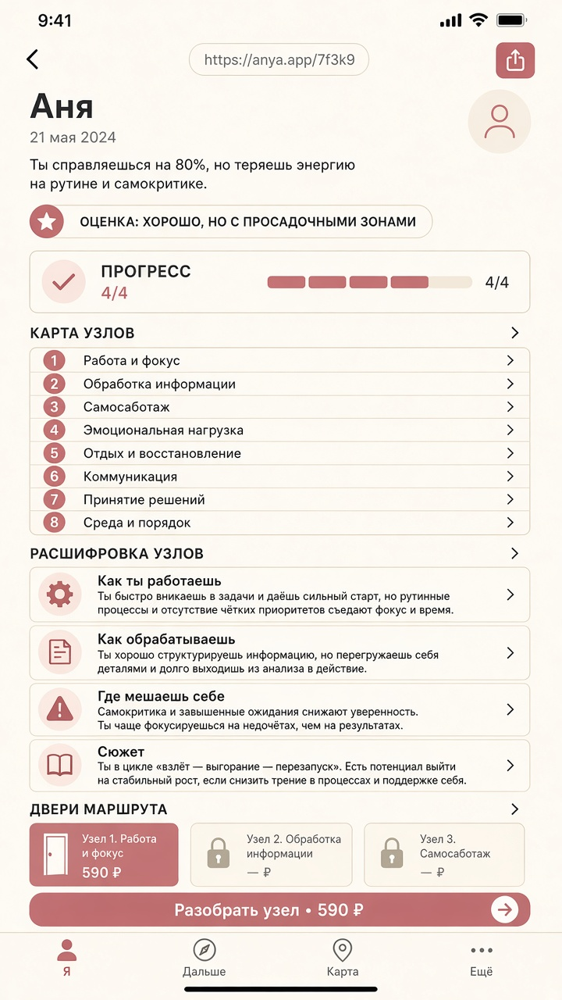
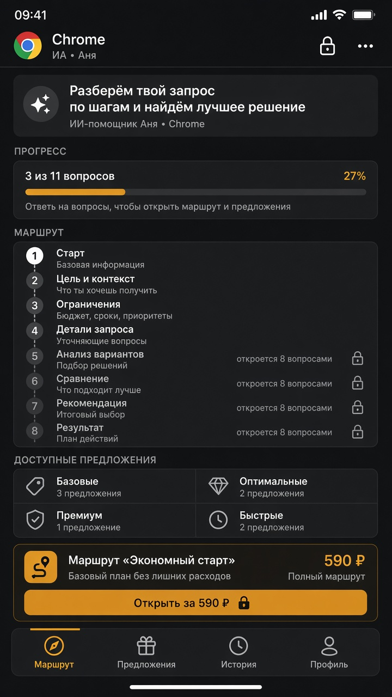
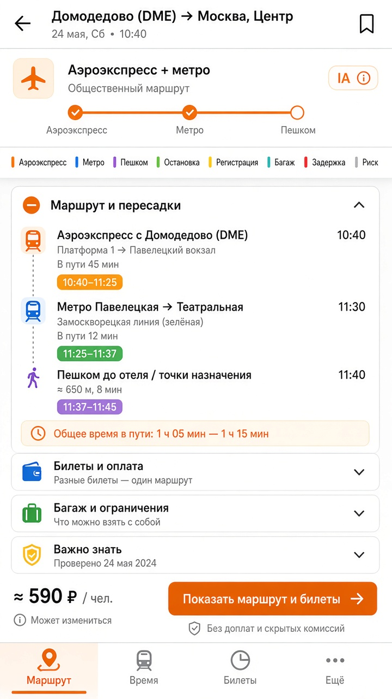
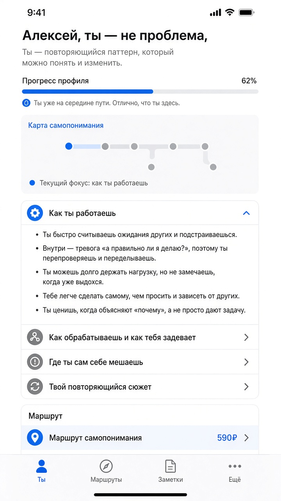
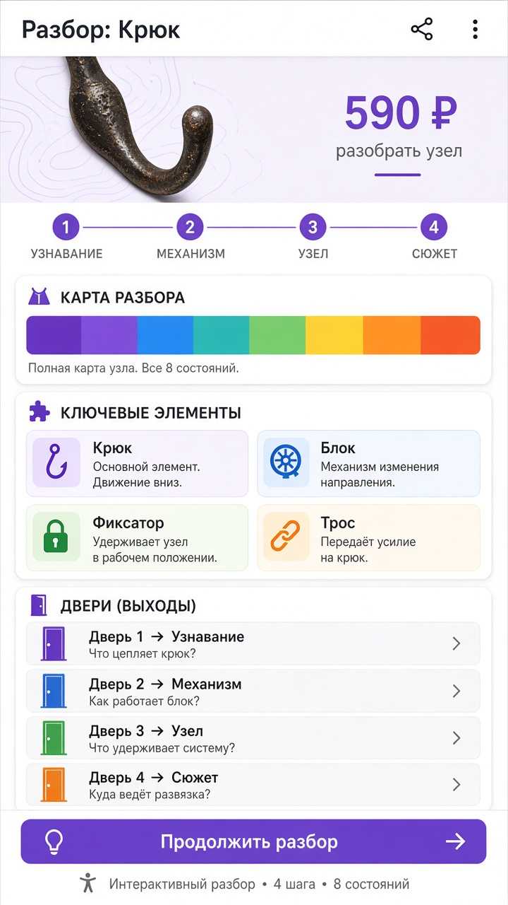
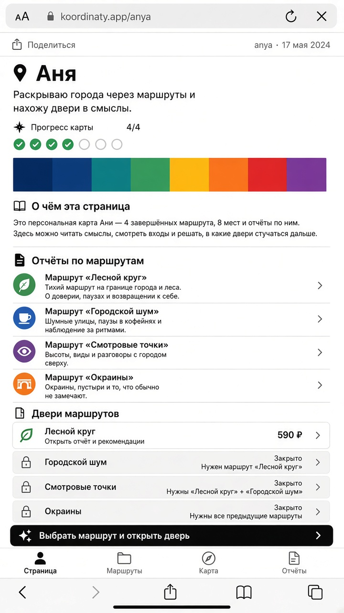
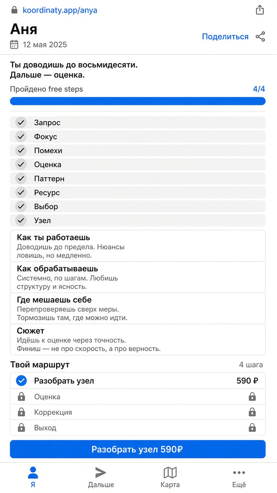
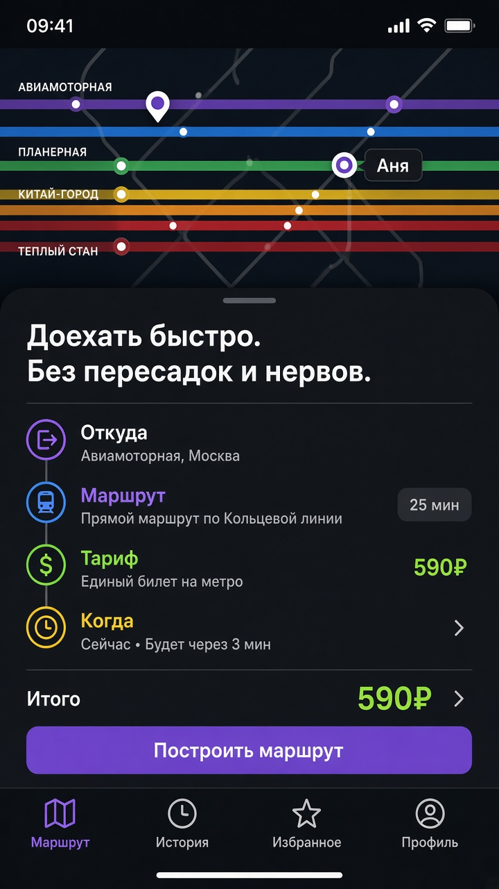
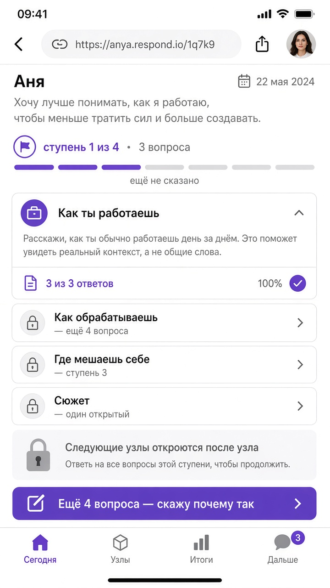

# 10 реальных каркасов страницы

Не плакаты. Один и тот же состав продукта, разная оболочка.

**Смотреть на GitHub:**  
https://github.com/7151104/self-discovery-ai/blob/cursor/ui-mockups-ten-interfaces-e6f8/docs/ui-mockups/real-ia/GALLERY.md

Канон блоков: [`docs/12-page-ia.md`](../../12-page-ia.md)

На странице обязаны быть, сверху вниз:

1. Ссылка + шаринг  
2. Имя, дата мелко  
3. Хук на 1–2 строки  
4. Прогресс лестницы (ступень из 4)  
5. Карта 6–8 полос без %  
6–9. Четыре блока: как работаешь → как задевает → узел без совета → сюжет с обрывом  
10. Маршрут: одно 590 ₽, остальные двери видны  
11. Одна кнопка  
12. Вкладки для возврата  

| # | Оболочка | Состояние |
|---|----------|-----------|
| 01 | iOS light | страница после 4 ступеней |
| 02 | Кремовое приложение | то же |
| 03 | Тёмная утилита | то же |
| 04 | Плотная вёрстка | то же, больше блоков в кадре |
| 05 | Аккордеон | то же |
| 06 | Material | то же |
| 07 | Документ | то же |
| 08 | Простая белая | то же |
| 09 | Карта сверху + шит | то же, другой жест |
| 10 | После ступени 1 | правильные закрытые блоки, CTA «ещё 4», не 590 |

Генерация может чуть плыть по кириллице. Если блок выпал — верь каркасу в `12-page-ia.md`, не картинке.

