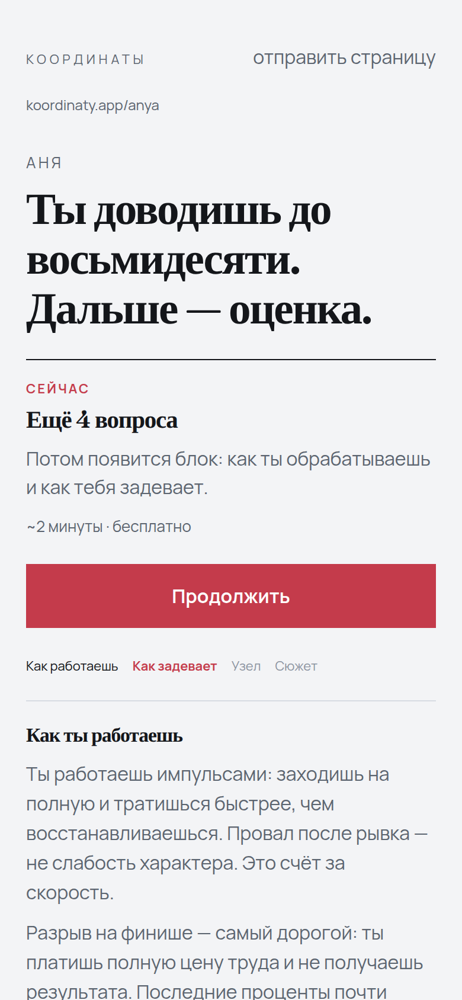
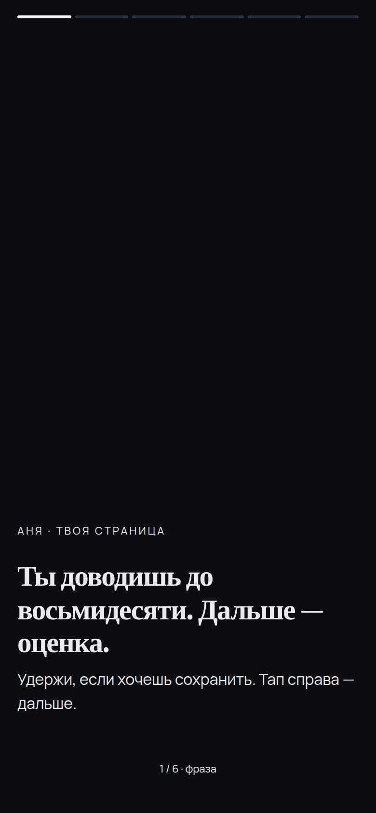
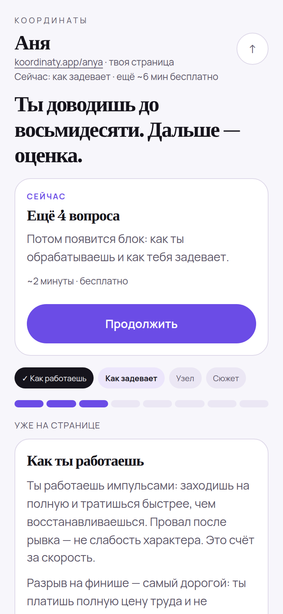
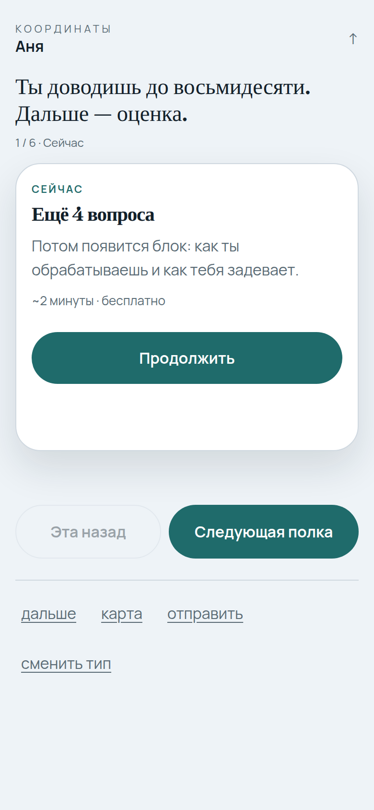
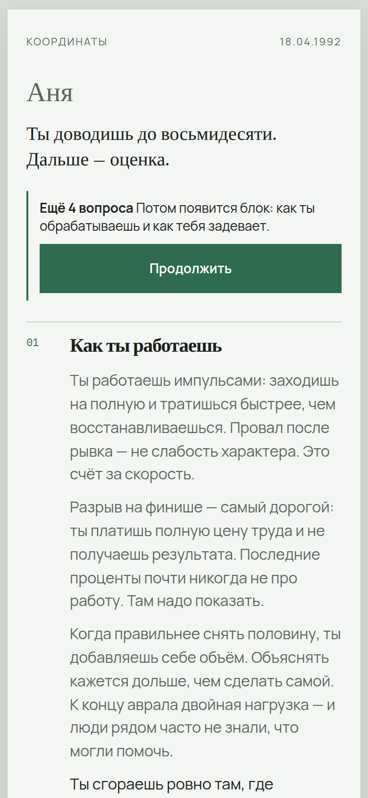
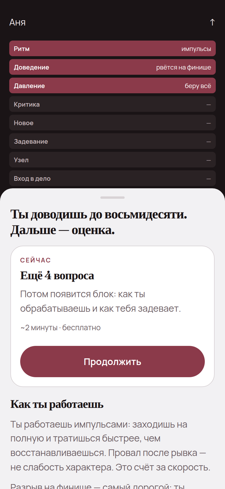
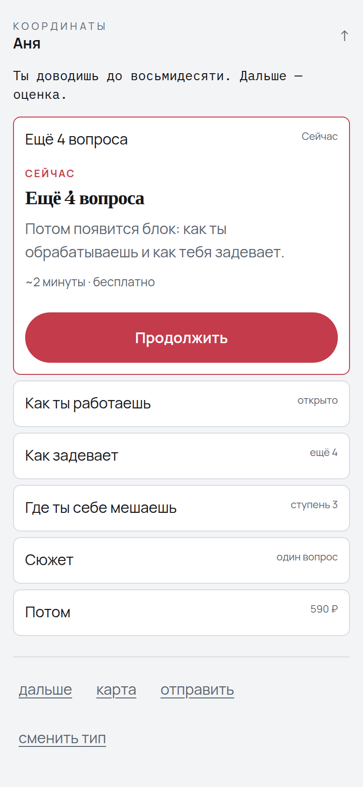
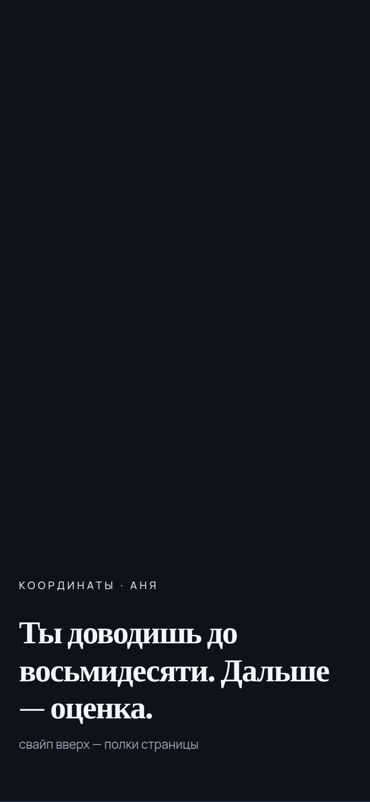
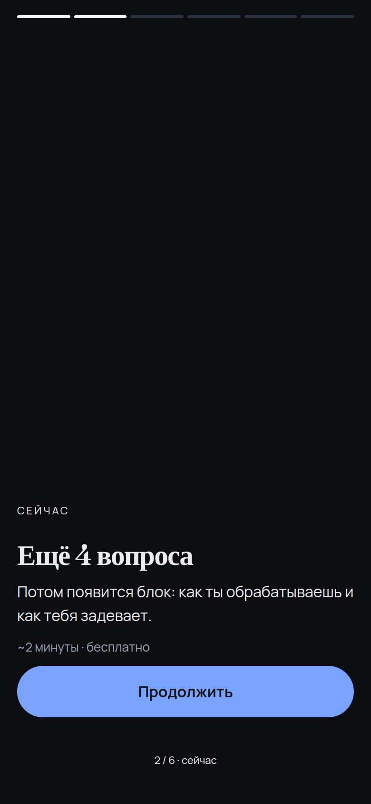

# Восемь типов страницы — не перекраска

Один состав продукта (хук, «Сейчас», лестница, полки, маршрут).  
**Разный ход:** навигация, жест, иерархия, характер. Цвет идёт за типом, не наоборот.

Живое: `prototype/` — на входе выбираешь тип, потом «Посмотреть, как это выглядит у Ани».

**Галерея:**  
https://github.com/7151104/self-discovery-ai/blob/cursor/ui-mockups-ten-interfaces-e6f8/docs/ui-mockups/type-systems/GALLERY.md

Правда — `live-*.png`. Это экраны прототипа.

| # | Тип | Жест | Откуда идея |
|---|-----|------|-------------|
| 01 | Артефакт | Всё на странице, без табов | mobile-10 / 01 |
| 02 | Сторис | Полный экран, тап по краям | mobile-10 / 02 |
| 03 | Вкладки | Я / Дальше / Карта / Ещё | mobile-10 / 03 |
| 04 | Колода | Одна полка = одна карточка | mobile-10 / 05 |
| 05 | Письмо | Документ с номерами 01–04 | real-ia / 07 |
| 06 | Карта + шит | Полосы сверху, текст снизу | real-ia / 09 |
| 07 | Аккордеон | Открыта одна полка | real-ia / 05 |
| 08 | Лента | Свайп вверх, экран = блок | mobile-10 / 08 |

Сторис, второй кадр («Сейчас»):

